# 城市管理系统 - 任务执行端（小程序端）产品需求文档 (PRD)

**文档版本**: v1.0  
**创建日期**: 2026-04-17  
**产品名称**: 城市管理系统 - 任务执行端  
**目标平台**: 移动端（小程序/H5）

---

## 一、文档概述

### 1.1 产品定位
任务执行端是城市管理系统的移动端应用，主要面向一线执行人员（管理人员、任务跟踪人员），用于日常巡查、事件上报、垃圾分类检查、建筑垃圾管理等现场作业场景。

### 1.2 用户角色
- **管理人员**: 可执行所有功能，包括任务执行、事件上报、事件验收等
- **任务跟踪人员**: 可执行任务、上报事件、进行事件整改等

### 1.3 核心功能模块
1. 入口选择页面
2. 任务执行端首页
3. 日常检查（我的任务）
4. 任务详情与执行
5. 垃圾分类检查
6. 随手拍（事件上报）
7. 事件整改
8. 事件验收
9. 随手拍清单
10. 建筑垃圾清运申请
11. 建筑垃圾核销

---

## 二、整体业务流程图

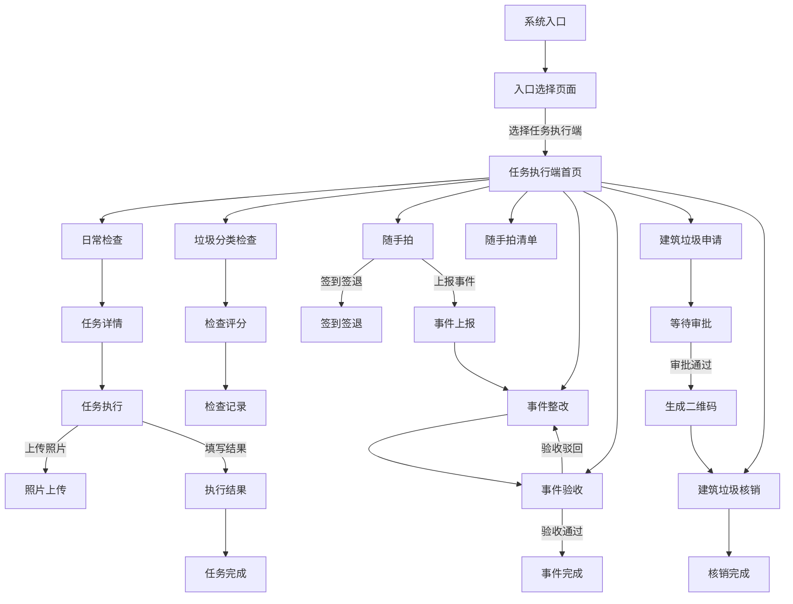

---

## 三、功能模块详细设计

### 3.1 入口选择页面

#### 3.1.1 功能描述
系统启动后的第一个页面，用户选择进入后台管理端或任务执行端。

#### 3.1.2 页面布局
- 页面标题：城市管理系统
- 副标题：请选择登录入口
- 两个入口卡片：
  - 后台管理端（蓝色主题，Shield图标）
  - 任务执行端（绿色主题，Briefcase图标）

#### 3.1.3 字段说明

| 字段名称 | 字段类型 | 是否必填 | 说明 | 交互规则 |
|---------|---------|---------|------|---------|
| 入口卡片 | 按钮卡片 | - | 显示入口名称和描述 | 点击跳转到对应端首页 |

#### 3.1.4 交互规则
1. 页面加载时显示渐变背景（蓝色到靛蓝色）
2. 两个入口卡片垂直排列，居中显示
3. 鼠标悬停时卡片放大1.03倍，显示边框高亮
4. 点击后台管理端跳转到 `/admin`
5. 点击任务执行端跳转到 `/task-execution`

#### 3.1.5 处理逻辑
- 无需登录验证，直接显示入口选择
- 点击后通过路由跳转到对应页面

#### 3.1.6 异常逻辑
- 无特殊异常处理

#### 3.1.7 流程图

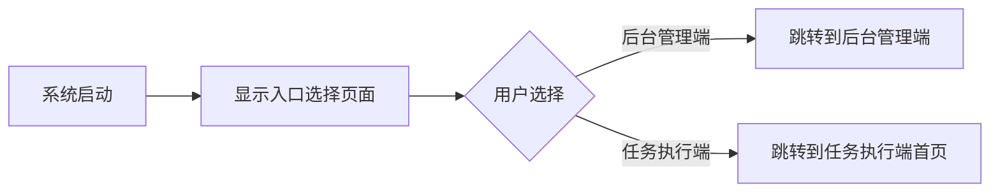

---

### 3.2 任务执行端首页

#### 3.2.1 功能描述
任务执行端的导航中心，展示所有可用功能模块的入口，方便用户快速访问各项功能。

#### 3.2.2 页面布局
- 顶部：标题"任务执行端"、副标题"日常检查、垃圾分类、随手拍、事件处理"、当前时间
- 主体：功能卡片网格（2列布局）
- 底部：版权信息和返回入口选择链接

#### 3.2.3 功能卡片列表

| 功能名称 | 图标 | 颜色主题 | 跳转路径 | 说明 |
|---------|------|---------|---------|------|
| 日常检查 | ClipboardList | 蓝色 | /my-tasks | 查看和执行巡查任务 |
| 垃圾分类检查 | Trash2 | 绿色 | /garbage-inspection-list | 检查垃圾分类情况并评分 |
| 随手拍 | Camera | 蓝色 | /hazard-reporting | 上传事件、整改和验收 |
| 随手拍清单 | CheckCircle | 靛蓝色 | /photo-report-list | 查看所有随手拍记录 |
| 事件整改 | AlertTriangle | 橙色 | /hazard-reporting?tab=process | 处理待整改隐患 |
| 事件验收 | CheckCircle | 紫色 | /hazard-reporting?tab=check | 验收整改结果 |
| 建筑垃圾清运申请 | Truck | 琥珀色 | /construction-waste-application | 提交建筑垃圾清运申请 |
| 建筑垃圾核销 | QrCode | 青色 | /construction-waste-verify | 核销申请方的二维码 |

#### 3.2.4 交互规则
1. 功能卡片采用网格布局，响应式设计（移动端2列，平板及以上可扩展）
2. 卡片悬停时放大1.02倍
3. 点击卡片跳转到对应功能页面
4. 底部"返回入口选择"链接可返回入口页面

#### 3.2.5 处理逻辑
- 页面加载时显示当前时间（实时更新）
- 根据用户角色显示对应的功能卡片（当前版本显示所有功能）

#### 3.2.6 异常逻辑
- 无特殊异常处理

#### 3.2.7 流程图

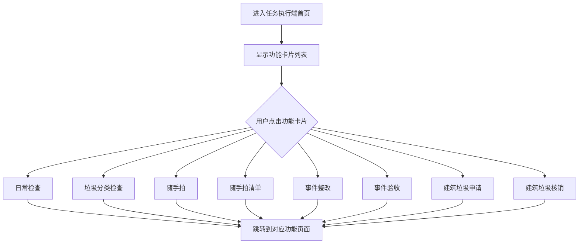

---
# 任务执行端PRD - 第二部分：日常检查与任务详情

---

## 四、日常检查（我的任务）

### 4.1 功能描述
展示分配给当前用户的所有任务列表，支持搜索、筛选，并提供任务的开始、照片上传、完成等操作。

### 4.2 页面布局
- 顶部固定导航栏：返回按钮、标题"我的任务"、建筑垃圾申请快捷入口
- 当前位置信息栏
- 搜索框
- 筛选下拉框（任务类型、任务状态）
- 任务卡片列表
- 照片上传弹窗（Modal）
- 执行结果填写弹窗（Modal）

### 4.3 字段说明

#### 4.3.1 搜索与筛选区域

| 字段名称 | 字段类型 | 是否必填 | 默认值 | 说明 | 交互规则 |
|---------|---------|---------|-------|------|---------|
| 搜索关键词 | 输入框（文本） | 否 | 空 | 搜索任务名称、描述、地址 | 实时过滤任务列表 |
| 任务类型 | 下拉框（Select） | 否 | 全部 | 按任务类型筛选 | 选择后立即过滤列表 |
| 任务状态 | 下拉框（Select） | 否 | 全部 | 按状态筛选 | 选择后立即过滤列表 |

**任务类型选项**：沿街店铺、流动摊贩、市政设施、人行道违停、工地管理、出店经营、广告牌、违挡、垃圾分类、环境卫生

**任务状态选项**：待处理、进行中、已完成、已取消

#### 4.3.2 任务卡片字段

| 字段名称 | 字段类型 | 是否必填 | 说明 | 备注 |
|---------|---------|---------|------|------|
| 任务名称 | 文本展示 | 是 | 任务标题 | 加粗显示 |
| 任务状态 | 标签（Badge） | 是 | 待处理/进行中/已完成/已取消 | 不同状态不同颜色 |
| 任务描述 | 文本展示 | 否 | 任务详细描述 | 最多显示2行，超出省略 |
| 任务类型 | 文本展示 | 是 | 任务所属类型 | - |
| 所属团队 | 文本展示 | 是 | 城市管理团队/序化管理团队 | - |
| 开始日期 | 文本展示 | 是 | 任务开始时间 | 格式：YYYY/MM/DD |
| 截止日期 | 文本展示 | 是 | 任务截止时间 | 格式：YYYY/MM/DD |
| 任务位置 | 文本展示（带图标） | 是 | 任务执行地址 | 带定位图标 |

#### 4.3.3 任务操作按钮

| 按钮名称 | 显示条件 | 颜色 | 操作说明 |
|---------|---------|------|---------|
| 详情 | 所有状态 | 蓝色 | 跳转到任务详情页 |
| 开始 | 状态=待处理 | 蓝色 | 将任务状态改为进行中 |
| 上传照片 | 状态=进行中 | 紫色 | 打开照片上传弹窗 |
| 完成 | 状态=进行中 | 绿色 | 打开执行结果填写弹窗 |

### 4.4 照片上传弹窗字段

| 字段名称 | 字段类型 | 是否必填 | 说明 | 交互规则 |
|---------|---------|---------|------|---------|
| 任务名称 | 文本展示 | - | 当前任务名称 | 只读 |
| 任务位置 | 文本展示 | - | 当前任务地址 | 只读 |
| 照片列表 | 图片展示 | - | 已上传的照片缩略图 | 支持删除单张 |
| 选择照片 | 文件上传（file input） | 是 | 选择本地图片 | 支持多选，仅限图片格式 |

### 4.5 执行结果填写弹窗字段

| 字段名称 | 字段类型 | 是否必填 | 选项/格式 | 说明 | 交互规则 |
|---------|---------|---------|---------|------|---------|
| 执行结果 | 单选按钮组（Radio） | 是 | 合格/不合格/部分合格 | 选择执行结果类型 | 选中项高亮显示 |
| 执行描述 | 多行文本框（Textarea） | 是 | 文本，最多500字 | 描述任务执行情况 | 为空时提交按钮禁用 |
| 问题详情 | 多行文本框（Textarea） | 否 | 文本 | 描述发现的问题 | 仅在结果为"不合格"或"部分合格"时显示 |
| 已现场解决 | 复选框（Checkbox） | 否 | 是/否 | 标记是否已现场解决 | 仅在结果为"不合格"或"部分合格"时显示 |
| 解决说明 | 多行文本框（Textarea） | 否 | 文本 | 描述解决措施 | 仅在"已现场解决"勾选时显示 |
| 已上传照片 | 图片展示 | - | 图片缩略图 | 展示已上传的检查照片 | 只读展示 |

### 4.6 交互规则
1. 页面加载时自动获取当前用户的任务列表（按assigneeId过滤）
2. 搜索框实时过滤，无需点击搜索按钮
3. 筛选条件变化时立即更新列表
4. 点击任务卡片（非按钮区域）跳转到任务详情页
5. 点击"开始"按钮后，按钮显示loading状态500ms，完成后任务状态变为"进行中"
6. 点击"上传照片"打开照片上传弹窗，确认上传后自动打开执行结果弹窗
7. 点击"完成"按钮：若已有照片则直接打开执行结果弹窗；若无照片也直接打开执行结果弹窗
8. 提交执行结果后，任务状态自动变为"已完成"

### 4.7 处理逻辑
1. 任务列表从API获取（当前为模拟数据，生成10条随机任务）
2. 过滤逻辑：同时满足搜索词、任务类型、任务状态、当前用户ID四个条件
3. 照片上传：使用FileReader读取本地文件，转为base64存储
4. 执行结果提交：模拟API调用（1秒延迟），成功后更新本地任务状态

### 4.8 异常逻辑
1. 任务列表为空时：显示空状态提示（AlertCircle图标 + "暂无符合条件的任务"）
2. 执行描述为空时：提交按钮禁用，无法提交
3. 照片上传失败：不影响执行结果提交（照片为可选）
4. 网络请求失败：显示loading状态，超时后恢复按钮可点击状态

### 4.9 流程图

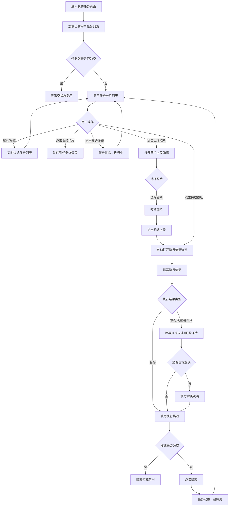

---

## 五、任务详情页

### 5.1 功能描述
展示单个任务的完整信息，并提供照片上传和执行结果填写功能，是任务执行的核心操作页面。

### 5.2 页面布局
- 顶部固定导航栏：返回按钮、标题"任务详情"
- 任务详情卡片
- 执行结果展示区（已有执行结果时显示）
- 照片上传区域
- 执行结果填写区域
- 底部操作按钮区

### 5.3 字段说明

#### 5.3.1 任务详情卡片

| 字段名称 | 字段类型 | 是否必填 | 说明 | 备注 |
|---------|---------|---------|------|------|
| 任务名称 | 文本展示 | 是 | 任务标题 | 大字体加粗 |
| 任务描述 | 文本展示 | 否 | 任务详细描述 | 带标签"任务描述:" |
| 任务类型 | 文本展示 | 是 | 任务所属类型 | 蓝色字体 |
| 所属团队 | 文本展示 | 是 | 团队名称 | 绿色字体 |
| 负责人 | 文本展示 | 是 | 任务负责人姓名 | 多人用逗号分隔 |
| 任务状态 | 标签（Badge） | 是 | 待处理/进行中/已完成/已取消 | 不同状态不同颜色 |
| 开始日期 | 文本展示 | 是 | 格式：YYYY-MM-DD | - |
| 截止日期 | 文本展示 | 是 | 格式：YYYY-MM-DD | - |
| 任务位置 | 文本展示（带图标） | 是 | 任务执行地址 | 带定位图标 |
| 当前位置 | 文本展示（带图标） | 是 | 用户当前位置 | 模拟数据：文一西路166号 |

#### 5.3.2 照片上传区域

| 字段名称 | 字段类型 | 是否必填 | 说明 | 交互规则 |
|---------|---------|---------|------|---------|
| 已上传照片 | 图片展示 | - | 已上传照片缩略图（3列网格） | 点击X可删除单张 |
| 选择照片按钮 | 文件上传（file input） | 否 | 选择本地图片 | 支持多选，仅限图片格式 |

#### 5.3.3 执行结果填写区域

| 字段名称 | 字段类型 | 是否必填 | 选项/格式 | 说明 | 交互规则 |
|---------|---------|---------|---------|------|---------|
| 执行结果 | 单选按钮组（Radio） | 是 | 合格/不合格/部分合格 | 选择执行结果类型 | 选中项高亮（蓝色边框+蓝色背景） |
| 执行描述 | 多行文本框（Textarea） | 是 | 文本，4行 | 描述任务执行情况 | placeholder: "请描述任务执行的具体情况..." |
| 问题详情 | 多行文本框（Textarea） | 否 | 文本，3行 | 描述发现的问题 | 仅在结果为"不合格"或"部分合格"时显示 |
| 已现场解决 | 复选框（Checkbox） | 否 | 是/否 | 标记是否已现场解决 | 仅在结果为"不合格"或"部分合格"时显示 |
| 解决说明 | 多行文本框（Textarea） | 否 | 文本，3行 | 描述解决措施 | 仅在"已现场解决"勾选时显示 |

#### 5.3.4 底部操作按钮

| 按钮名称 | 类型 | 禁用条件 | 说明 |
|---------|------|---------|------|
| 确认上传 | 次要按钮 | 无照片或loading中 | 确认上传已选照片 |
| 完成任务 | 主要按钮 | 执行描述为空或loading中 | 提交执行结果，完成任务 |

### 5.4 交互规则
1. 页面通过URL参数 `taskId` 加载对应任务数据
2. 任务加载中显示"加载中..."提示
3. 执行结果类型切换时，条件字段（问题详情、已现场解决、解决说明）动态显示/隐藏
4. 已有执行结果时，在任务详情卡片下方显示执行结果展示区
5. 确认上传按钮：无照片时禁用，有照片时可点击，点击后模拟上传（1秒）
6. 完成任务按钮：执行描述为空时禁用，点击后提交执行结果并将任务状态改为"已完成"

### 5.5 处理逻辑
1. 通过 `taskId` 从任务列表中查找对应任务
2. 照片上传：FileReader读取文件转base64，存储在本地状态
3. 执行结果提交：模拟API调用（1秒延迟），成功后更新任务状态为"已完成"
4. 提交成功后重置执行结果表单和照片列表

### 5.6 异常逻辑
1. `taskId` 不存在时：显示"加载中..."（实际应显示404提示）
2. 执行描述为空时：完成任务按钮禁用，无法提交
3. 照片上传失败：不影响执行结果提交

### 5.7 流程图

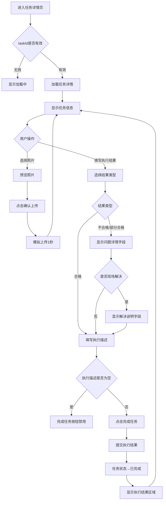

---
# 任务执行端PRD - 第三部分：垃圾分类检查

---

## 六、垃圾分类检查

### 6.1 功能描述
用于对小区、村社的垃圾分类情况进行现场检查和评分，支持多维度扣分项目，自动计算总分，并生成检查记录。

### 6.2 页面布局
- 顶部固定导航栏：返回按钮、标题"垃圾分类检查"、设置按钮
- 区域选择器（区/街道、小区、村社）
- 评分区域（可折叠的分类项）
  - 1. 分类质量（总分40分）
  - 2. 分类设施（总分30分）
  - 3. 分类辅导（总分20分）
  - 4. 分类清运（总分10分）
- 当前得分显示（大字体，动态更新）
- 提交检查按钮

### 6.3 字段说明

#### 6.3.1 区域选择器

| 字段名称 | 字段类型 | 是否必填 | 默认值 | 说明 | 交互规则 |
|---------|---------|---------|-------|------|---------|
| 区/街道 | 选择器（Picker） | 是 | 浙江省杭州市余杭区南苑街道 | 选择检查区域 | 点击弹出选择器弹窗 |
| 小区 | 选择器（Picker） | 是 | 新社区 | 选择检查小区 | 点击弹出选择器弹窗 |
| 村社 | 选择器（Picker） | 是 | 大陆村 | 选择检查村社 | 点击弹出选择器弹窗 |

**区/街道选项**：
- 浙江省杭州市余杭区南苑街道
- 浙江省杭州市余杭区临平街道
- 浙江省杭州市余杭区星桥街道
- 浙江省杭州市西湖区文新街道
- 浙江省杭州市西湖区古荡街道

**小区选项**：新社区、老社区、幸福小区、和谐家园、阳光花园

**村社选项**：大陆村、七贤桥村、南村、北村、中村

#### 6.3.2 评分项字段

每个评分项包含以下字段：

| 字段名称 | 字段类型 | 是否必填 | 说明 | 交互规则 |
|---------|---------|---------|------|---------|
| 分类标题 | 文本展示 | 是 | 如"1.分类质量" | 可点击折叠/展开 |
| 总分 | 文本展示 | 是 | 该分类的总分值 | 显示在标题右侧 |
| 扣分项列表 | 复选框列表 | 否 | 可选的扣分项 | 勾选后自动扣分 |
| 扣分项文本 | 文本展示 | 是 | 扣分项描述 | - |
| 扣分值 | 文本展示 | 是 | 该项扣分分值 | 红色字体显示 |
| 照片上传 | 图片上传 | 否 | 扣分项对应的照片 | 点击相机图标上传 |

#### 6.3.3 分类质量（总分40分）扣分项

| 扣分项ID | 扣分项描述 | 扣分值 | 是否必填 |
|---------|-----------|-------|---------|
| quality-1 | 分类质量不合格 | 40 | 否 |
| quality-2 | 存在轻微混投 | 5 | 否 |
| quality-3 | 存在混投现象 | 10 | 否 |
| quality-4 | 未开展或虚设定时定点 | 20 | 否 |

#### 6.3.4 分类设施（总分30分）扣分项

| 扣分项ID | 扣分项描述 | 扣分值 | 是否必填 |
|---------|-----------|-------|---------|
| facility-1 | 分类投放点未配齐四类垃圾投放设施 | 5 | 否 |
| facility-2 | 发现染色桶 | 5 | 否 |
| facility-3 | 未对误时投放方式进行说明 | 5 | 否 |
| facility-4 | 分类设施过于陈旧、褪色、破损、脏污 | 5 | 否 |
| facility-5 | 分类设施地面油污、污水横流 | 10 | 否 |
| facility-6 | 再生资源站点未设置的或作用他用 | 10 | 否 |
| facility-7 | 共用的再生资源站点未设置在公共区域，覆盖距离、户数不达标 | 10 | 否 |
| facility-8 | 站点面积未达要求 | 10 | 否 |
| facility-9 | 站点内管理制度、兑换价目表、回收单位及人员等信息公示不全 | 5 | 否 |
| facility-10 | 再生资源站点位指引不准确、过期与实际位置不符 | 5 | 否 |
| facility-11 | 站点运营时间未达标 | 5 | 否 |
| facility-12 | 站点台账记录不全 | 5 | 否 |
| facility-13 | 站点环境卫生情况差 | 5 | 否 |
| facility-14 | 特殊垃圾临时投放点未设置，未公示收运方式 | 10 | 否 |
| facility-15 | 临时堆放点未规范设置围档 | 5 | 否 |
| facility-16 | 临时堆放点地面未硬化 | 5 | 否 |
| facility-17 | 特殊垃圾临时堆放点未分区或混投 | 10 | 否 |
| facility-18 | 临时堆放点杂乱，环境卫生差 | 5 | 否 |
| facility-19 | 临时堆放点挪作他用 | 10 | 否 |
| facility-20 | 临时堆放点未设置告示牌 | 5 | 否 |
| facility-21 | 告示牌信息不全 | 5 | 否 |

#### 6.3.5 分类辅导（总分20分）扣分项

| 扣分项ID | 扣分项描述 | 扣分值 | 是否必填 |
|---------|-----------|-------|---------|
| guidance-1 | 未设置或设置分类指示员 | 5 | 否 |
| guidance-2 | 指示牌公示信息不到位 | 1 | 否 |
| guidance-3 | 指示牌存在破损、脏污 | 1 | 否 |
| guidance-4 | 投放时段无人值守 | 5 | 否 |
| guidance-5 | 小区内存在垃圾散管 | 2 | 否 |
| guidance-6 | 未开展宣传活动 | 3 | 否 |
| guidance-7 | 宣传资料不足 | 2 | 否 |
| guidance-8 | 居民知晓率低 | 5 | 否 |

#### 6.3.6 分类清运（总分10分）扣分项

| 扣分项ID | 扣分项描述 | 扣分值 | 是否必填 |
|---------|-----------|-------|---------|
| transport-1 | 垃圾超过桶身，无合适 | 4 | 否 |
| transport-2 | 集置点环境卫生情况差 | 5 | 否 |
| transport-3 | 清运不及时 | 3 | 否 |
| transport-4 | 清运车辆不规范 | 2 | 否 |

#### 6.3.7 当前得分显示

| 字段名称 | 字段类型 | 说明 | 计算规则 |
|---------|---------|------|---------|
| 当前得分 | 数字展示 | 实时计算的总分 | 100 - 所有勾选项的扣分值之和 |

### 6.4 交互规则
1. 页面加载时，所有分类项默认展开
2. 点击分类标题可折叠/展开该分类的扣分项列表
3. 勾选扣分项后，自动计算并更新当前得分
4. 当前得分大字体居中显示，颜色根据分数变化：
   - 90-100分：绿色
   - 80-89分：蓝色
   - 70-79分：橙色
   - 70分以下：红色
5. 点击扣分项右侧的相机图标可上传照片（支持多张）
6. 点击"提交检查"按钮后，验证是否选择了区域，未选择则提示错误
7. 提交成功后显示成功提示，并跳转到检查记录列表页

### 6.5 处理逻辑
1. 区域选择器：点击后弹出选择器弹窗，选择后更新对应字段
2. 扣分项勾选：勾选后将该项的扣分值累加到总扣分，取消勾选则减去该扣分值
3. 得分计算：当前得分 = 100 - 总扣分值
4. 照片上传：使用FileReader读取文件转base64，关联到对应扣分项
5. 提交检查：
   - 验证区域是否选择
   - 收集所有勾选的扣分项和对应照片
   - 生成检查记录对象（包含区域、得分、扣分项、检查时间、检查人等）
   - 模拟API提交（1秒延迟）
   - 提交成功后跳转到检查记录列表页

### 6.6 异常逻辑
1. 未选择区域时提交：显示错误提示"请选择检查区域"
2. 照片上传失败：不影响检查提交，照片为可选项
3. 网络请求失败：显示错误提示，保留当前填写内容

### 6.7 备注
- 检查记录会保存到本地存储（localStorage）或提交到后端API
- 检查人信息从当前登录用户获取
- 检查时间自动记录为提交时的系统时间

### 6.8 流程图

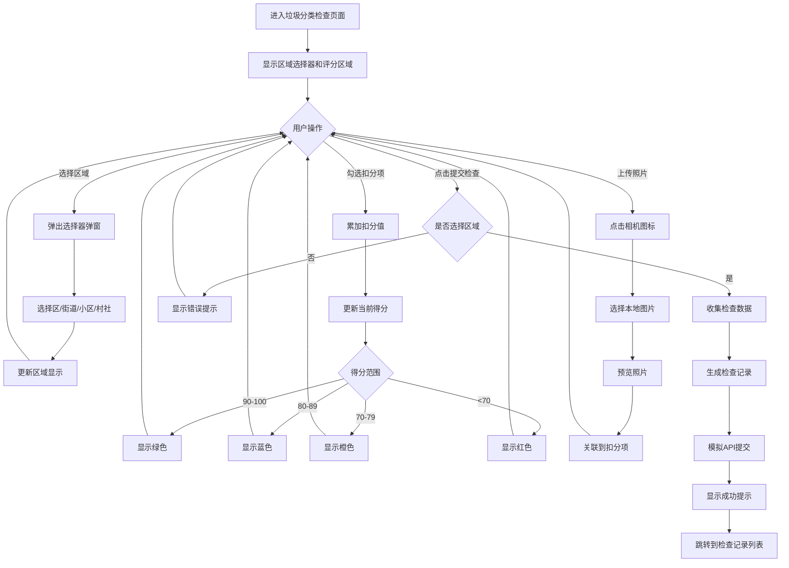

---

## 七、垃圾分类检查记录列表

### 7.1 功能描述
展示所有垃圾分类检查记录，支持查看详情、统计分析、筛选等功能。

### 7.2 页面布局
- 顶部固定导航栏：返回按钮、标题"垃圾分类检查列表"、新增检查按钮
- 筛选区域（村社、网格、小区、时间范围）
- 统计图表（可选）
- 检查记录卡片列表
- 检查详情弹窗（Modal）
- 图片预览弹窗（Modal）

### 7.3 字段说明

#### 7.3.1 筛选区域

| 字段名称 | 字段类型 | 是否必填 | 默认值 | 说明 | 交互规则 |
|---------|---------|---------|-------|------|---------|
| 村社 | 选择器（Picker） | 否 | 全部 | 按村社筛选 | 点击弹出选择器 |
| 网格 | 选择器（Picker） | 否 | 全部 | 按网格筛选 | 点击弹出选择器 |
| 小区 | 选择器（Picker） | 否 | 全部 | 按小区筛选 | 点击弹出选择器 |
| 开始日期 | 日期选择器 | 否 | 空 | 筛选开始日期 | 点击弹出日期选择器 |
| 结束日期 | 日期选择器 | 否 | 空 | 筛选结束日期 | 点击弹出日期选择器 |

#### 7.3.2 检查记录卡片

| 字段名称 | 字段类型 | 是否必填 | 说明 | 备注 |
|---------|---------|---------|------|------|
| 记录ID | 文本展示 | 是 | 检查记录唯一标识 | 显示在卡片头部 |
| 小区名称 | 文本展示 | 是 | 检查的小区 | 加粗显示 |
| 村社名称 | 文本展示 | 是 | 检查的村社 | - |
| 得分 | 数字展示（大字体） | 是 | 检查得分 | 根据分数显示不同颜色 |
| 检查日期 | 文本展示 | 是 | 检查时间 | 格式：YYYY-MM-DD |
| 检查人 | 文本展示 | 是 | 检查人姓名 | - |
| 区/街道 | 文本展示 | 是 | 检查区域 | - |
| 扣分项数量 | 文本展示 | 是 | 扣分项总数 | 显示在卡片底部 |

#### 7.3.3 检查详情弹窗

| 字段名称 | 字段类型 | 说明 | 备注 |
|---------|---------|------|------|
| 基本信息 | 文本展示 | 小区、村社、得分、日期、检查人、区域 | 只读 |
| 扣分项列表 | 可折叠列表 | 按分类展示所有扣分项 | 可展开查看详情 |
| 扣分项分类 | 文本展示 | 分类质量/分类设施/分类辅导/分类清运 | 可点击折叠/展开 |
| 扣分项描述 | 文本展示 | 扣分项具体描述 | - |
| 扣分值 | 文本展示 | 该项扣分分值 | 红色字体 |
| 扣分项图片 | 图片展示 | 扣分项对应的照片 | 点击可放大预览 |

### 7.4 交互规则
1. 页面加载时显示所有检查记录，按时间倒序排列
2. 筛选条件变化时立即过滤记录列表
3. 点击记录卡片打开检查详情弹窗
4. 详情弹窗中，扣分项按分类折叠显示，点击分类标题可展开/折叠
5. 点击扣分项图片可放大预览，支持左右滑动切换
6. 点击"新增检查"按钮跳转到垃圾分类检查页面

### 7.5 处理逻辑
1. 从localStorage或API加载检查记录列表
2. 筛选逻辑：同时满足村社、网格、小区、时间范围四个条件
3. 得分颜色规则：
   - 90-100分：绿色
   - 80-89分：蓝色
   - 70-79分：橙色
   - 70分以下：红色

### 7.6 异常逻辑
1. 记录列表为空时：显示空状态提示
2. 图片加载失败：显示占位图

### 7.7 流程图

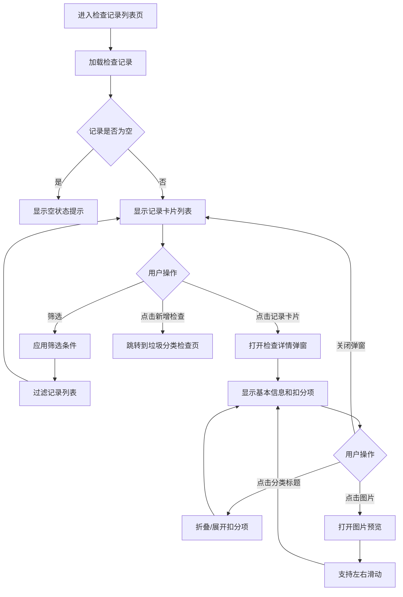

---
# 任务执行端PRD - 第四部分：随手拍功能模块

---

## 八、随手拍（HazardReportingPage）

随手拍页面包含四个子功能Tab：签到签退、随手拍（事件上报）、事件整改、事件验收。

### 8.1 页面布局
- 顶部导航栏：返回按钮、标题"随手拍"（绿色背景）
- Tab切换栏：签到签退 / 随手拍 / 事件整改 / 事件验收 / 随手拍清单
- Tab内容区域

**Tab权限控制**：
- 签到签退：所有人员可访问
- 随手拍：所有人员可访问
- 事件整改：管理人员和任务跟踪人员可访问
- 事件验收：仅管理人员可访问
- 随手拍清单：所有人员可访问（跳转到独立页面）

---

## 九、签到签退

### 9.1 功能描述
记录执行人员的上班签到和下班签退，需要拍照并自动添加位置水印。

### 9.2 字段说明

#### 9.2.1 签到信息展示

| 字段名称 | 字段类型 | 是否必填 | 说明 | 备注 |
|---------|---------|---------|------|------|
| 签到状态 | 文本展示 | - | 已签到/未签到 | 绿色/灰色字体 |
| 签到时间 | 文本展示 | - | 签到的具体时间 | 格式：YYYY/MM/DD HH:mm:ss，签到后显示 |
| 签到位置 | 文本展示 | - | 签到时的地理位置 | 签到后显示 |
| 签到照片 | 图片展示 | - | 签到时拍摄的照片（含水印） | 签到后显示，20x20缩略图 |

#### 9.2.2 签退信息展示

| 字段名称 | 字段类型 | 是否必填 | 说明 | 备注 |
|---------|---------|---------|------|------|
| 签退状态 | 文本展示 | - | 已签退/未签退 | 紫色/灰色字体 |
| 签退时间 | 文本展示 | - | 签退的具体时间 | 格式：YYYY/MM/DD HH:mm:ss，签退后显示 |
| 签退位置 | 文本展示 | - | 签退时的地理位置 | 签退后显示 |
| 签退照片 | 图片展示 | - | 签退时拍摄的照片（含水印） | 签退后显示，20x20缩略图 |

#### 9.2.3 操作按钮

| 按钮名称 | 类型 | 禁用条件 | 颜色 | 说明 |
|---------|------|---------|------|------|
| 签到打卡 | 主要按钮 | 已签到 | 绿色 | 打开签到照片上传弹窗 |
| 签退打卡 | 主要按钮 | 未签到或已签退 | 紫色 | 打开签退照片上传弹窗 |

#### 9.2.4 签到/签退照片上传弹窗

| 字段名称 | 字段类型 | 是否必填 | 说明 | 交互规则 |
|---------|---------|---------|------|---------|
| 照片上传 | 文件上传（file input） | 是 | 选择签到/签退照片 | 仅限图片格式，选择后自动添加位置水印 |
| 照片预览 | 图片展示 | - | 预览带水印的照片 | 上传后显示 |
| 确认按钮 | 主要按钮 | 未上传照片 | 绿色/紫色 | 确认签到/签退 |
| 取消按钮 | 次要按钮 | - | 灰色 | 关闭弹窗 |

### 9.3 交互规则
1. 点击"签到打卡"按钮打开签到照片上传弹窗
2. 选择照片后，系统自动在照片上添加位置水印（位置+时间）
3. 点击"确认"完成签到，记录签到时间和位置
4. 签到后"签到打卡"按钮变为禁用状态
5. 点击"签退打卡"按钮（需先签到），打开签退照片上传弹窗
6. 签退流程与签到相同
7. 签退后"签退打卡"按钮变为禁用状态

### 9.4 处理逻辑
1. 位置获取：使用默认地址（浙江省杭州市余杭区良渚路166号）
2. 水印添加：使用Canvas API在图片上绘制位置+时间水印
3. 时间记录：使用系统当前时间，格式化为中文日期时间格式
4. 状态管理：签到/签退状态保存在本地状态（实际应提交到后端）

### 9.5 异常逻辑
1. 未上传照片时点击确认：显示错误提示"请上传签到照片"
2. 未签到时点击签退：显示错误提示"请先签到再签退"
3. 照片处理失败：使用原始照片URL作为备选

### 9.6 流程图

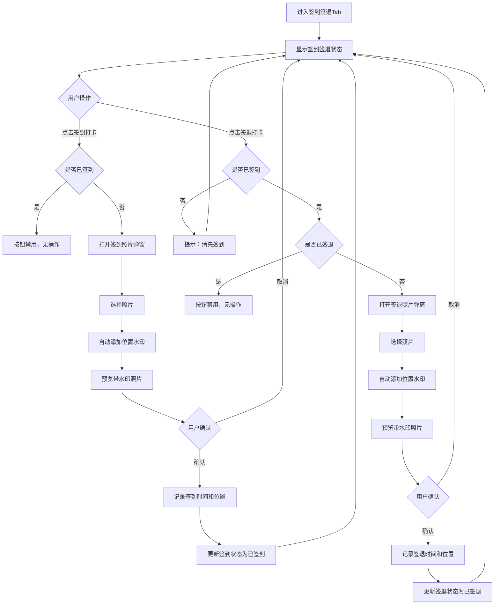

---

## 十、随手拍（事件上报）

### 10.1 功能描述
用于现场拍照上报城市管理事件，填写事件详情并指派处理人员。

### 10.2 字段说明

| 字段名称 | 字段类型 | 是否必填 | 选项/格式 | 说明 | 交互规则 |
|---------|---------|---------|---------|------|---------|
| 事件图片 | 图片上传（多选） | 是 | 图片格式（jpg/png等） | 拍照或从相册选择 | 支持拍照和从相册选择两种方式；选择后自动添加位置水印；可删除已选图片 |
| 事件描述 | 多行文本框（Textarea） | 否 | 文本，最多500字 | 详细描述事件情况 | placeholder: "请详细描述事件情况" |
| 事件位置 | 输入框（文本）+ 定位按钮 | 是 | 文本地址 | 事件发生位置 | 可手动输入或点击"定位"按钮自动获取；定位成功后自动填入地址 |
| 事件所属分类 | 下拉框（Select） | 是 | 见下方选项 | 事件类型分类 | 选择后更新表单值 |
| 事件等级 | 下拉框（Select） | 是 | 特急/急/一般 | 事件紧急程度 | 选择后更新表单值 |
| 整改方式 | 下拉框（Select） | 是 | 限期整改/立即整改 | 整改要求方式 | 选择后更新表单值 |
| 整改时限 | 日期选择器（date） | 是 | YYYY-MM-DD | 整改截止日期 | 点击弹出日期选择器 |
| 指派处理人 | 人员选择器（Picker） | 是 | 人员列表 | 指派负责处理的人员 | 点击弹出人员选择弹窗，显示所有活跃人员 |
| 提交按钮 | 主要按钮 | - | - | 提交事件报告 | 点击触发表单验证和提交 |

**事件所属分类选项**：广告牌、违挡、沿街店铺、城市绿化、墙体倒塌、修路开挖、流动摊贩、地铁口管理、人行道违停、出店经营、工地、市政设施安全巡查

### 10.3 交互规则
1. 图片上传提供两个入口：拍照（Camera图标）和从相册选择（Image图标）
2. 选择图片后自动添加位置+时间水印
3. 已选图片以缩略图形式展示，右上角有删除按钮
4. 点击"定位"按钮自动获取当前位置并填入事件位置字段
5. 点击"指派处理人"弹出人员选择弹窗，显示所有活跃人员列表
6. 人员选择弹窗中显示人员姓名和类型（管理人员/任务跟踪人员）
7. 提交前进行表单验证，必填字段为空时显示错误提示
8. 提交成功后重置表单，显示成功提示

### 10.4 处理逻辑
1. 图片处理：使用Canvas API添加水印（位置+时间）
2. 位置获取：使用默认地址（浙江省杭州市余杭区良渚路166号）
3. 人员列表：从usePeople Hook获取所有活跃人员
4. 表单验证：检查所有必填字段是否填写
5. 提交：创建新的事件对象，添加到事件列表，保存到localStorage

### 10.5 异常逻辑
1. 必填字段为空时提交：显示错误提示，阻止提交
2. 图片上传失败：显示错误提示，可重新选择
3. 位置获取失败：使用默认地址，显示提示信息

### 10.6 流程图

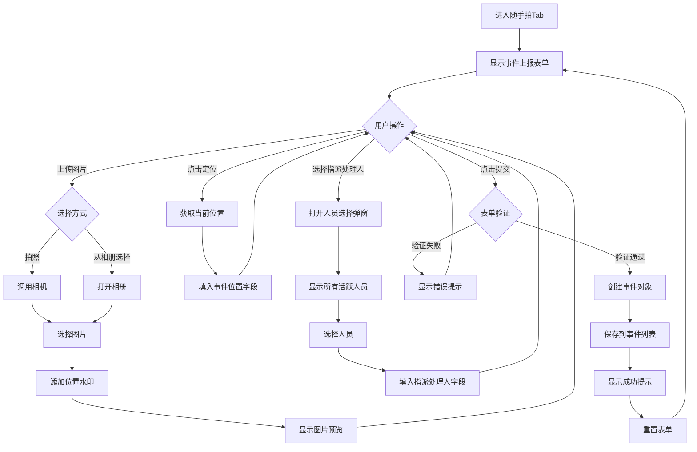

---

## 十一、事件整改

### 11.1 功能描述
展示待整改的事件列表，整改人员可以查看事件详情、提交整改结果或标记拒不整改。

### 11.2 字段说明

#### 11.2.1 筛选区域

| 字段名称 | 字段类型 | 是否必填 | 默认值 | 说明 | 交互规则 |
|---------|---------|---------|-------|------|---------|
| 事件描述搜索 | 输入框（文本） | 否 | 空 | 搜索事件标题或描述 | 实时过滤列表 |
| 状态筛选 | 下拉框（Select） | 否 | 全部状态 | 按状态筛选 | 选项：全部/待处理/处理中/拒不整改 |

#### 11.2.2 事件卡片字段

| 字段名称 | 字段类型 | 是否必填 | 说明 | 备注 |
|---------|---------|---------|------|------|
| 事件标题 | 文本展示 | 是 | 事件名称 | 加粗显示 |
| 事件状态 | 标签（Badge） | 是 | 待处理/处理中/拒不整改 | 不同状态不同颜色 |
| 事件描述 | 文本展示 | 否 | 事件详细描述 | 灰色背景展示 |
| 事件图片 | 图片缩略图 | 否 | 最多显示3张，超出显示+N | 点击可放大预览 |
| 事件位置 | 文本展示（带图标） | 是 | 事件发生地址 | 带定位图标 |
| 上报时间 | 文本展示 | 是 | 事件上报时间 | - |
| 整改时限 | 文本展示 | 是 | 整改截止日期 | - |
| 整改负责人 | 文本展示 | 否 | 负责整改的人员 | - |

#### 11.2.3 操作按钮

| 按钮名称 | 显示条件 | 颜色 | 说明 |
|---------|---------|------|------|
| 整改 | 状态=待处理或处理中 | 绿色 | 打开整改详情弹窗 |
| 拒不整改 | 状态=待处理或处理中 | 红色 | 打开拒不整改原因弹窗 |
| 转交 | 状态=待处理或处理中 | 蓝色 | 打开转交弹窗 |

#### 11.2.4 整改详情弹窗字段

| 字段名称 | 字段类型 | 是否必填 | 说明 | 交互规则 |
|---------|---------|---------|------|---------|
| 整改图片 | 图片上传（多选） | 是 | 整改后的现场照片 | 支持多选，自动添加位置水印 |
| 整改描述 | 多行文本框（Textarea） | 否 | 整改情况描述 | - |
| 签名 | 图片上传 | 是 | 整改人签名图片 | 上传签名图片 |
| 提交按钮 | 主要按钮 | - | 提交整改结果 | 无图片或无签名时禁用 |

#### 11.2.5 拒不整改弹窗字段

| 字段名称 | 字段类型 | 是否必填 | 说明 | 交互规则 |
|---------|---------|---------|------|---------|
| 拒不整改原因 | 多行文本框（Textarea） | 是 | 填写拒不整改的原因 | 为空时确认按钮禁用 |
| 确认按钮 | 主要按钮 | - | 确认标记为拒不整改 | 原因为空时禁用 |
| 取消按钮 | 次要按钮 | - | 关闭弹窗 | - |

#### 11.2.6 转交弹窗字段

| 字段名称 | 字段类型 | 是否必填 | 说明 | 交互规则 |
|---------|---------|---------|------|---------|
| 接收人 | 下拉框（Select） | 是 | 选择接收人 | 从人员列表中选择 |
| 转交备注 | 多行文本框（Textarea） | 否 | 转交说明 | - |
| 确认按钮 | 主要按钮 | - | 确认转交 | 未选择接收人时禁用 |
| 取消按钮 | 次要按钮 | - | 关闭弹窗 | - |

### 11.3 交互规则
1. 页面加载时显示所有待整改事件（状态为pending/processing/refused）
2. 搜索和筛选实时过滤列表
3. 点击事件卡片打开事件详情弹窗
4. 点击"整改"按钮打开整改详情弹窗
5. 整改图片上传后自动添加位置水印
6. 提交整改结果后，事件状态更新为"处理中"
7. 点击"拒不整改"打开原因填写弹窗，确认后事件状态更新为"拒不整改"
8. 点击"转交"打开转交弹窗，确认后事件转交给指定人员

### 11.4 处理逻辑
1. 事件列表过滤：显示状态为pending/processing/refused的事件
2. 整改提交：更新事件状态为"processing"，添加整改图片到事件图片列表
3. 拒不整改：更新事件状态为"refused"，记录拒绝原因
4. 转交：更新事件的assignedPerson字段，记录转交信息

### 11.5 异常逻辑
1. 整改图片为空时提交：显示错误提示"请上传整改后的图片"
2. 签名为空时提交：显示错误提示"请上传签名"
3. 拒不整改原因为空时确认：显示错误提示"请填写拒不整改原因"
4. 转交未选择接收人时确认：显示错误提示"请选择接收人"

### 11.6 流程图

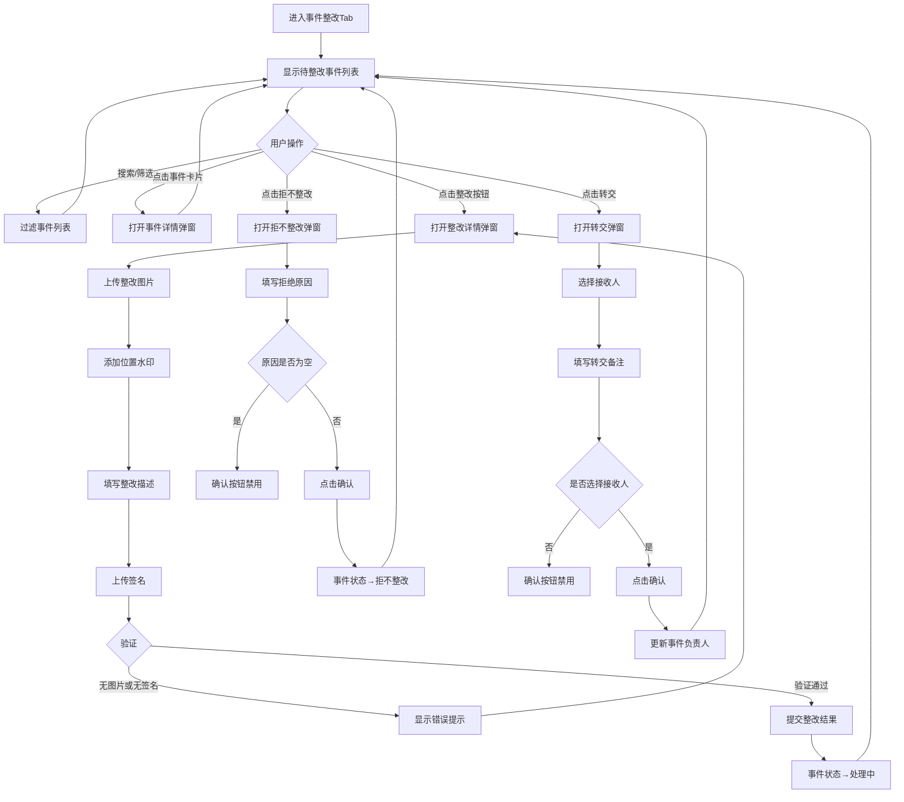

---

## 十二、事件验收

### 12.1 功能描述
管理人员对已整改的事件进行验收，可以验收通过或驳回，需要上传验收照片和签名。

### 12.2 权限控制
- 仅管理人员（personType === '管理人员'）可访问此Tab
- 非管理人员点击验收操作时显示错误提示

### 12.3 字段说明

#### 12.3.1 事件列表（同整改列表，但显示状态为processing的事件）

| 字段名称 | 字段类型 | 是否必填 | 说明 | 备注 |
|---------|---------|---------|------|------|
| 事件标题 | 文本展示 | 是 | 事件名称 | - |
| 事件状态 | 标签（Badge） | 是 | 处理中 | 蓝色 |
| 事件描述 | 文本展示 | 否 | 事件详细描述 | - |
| 整改图片 | 图片缩略图 | 否 | 整改后的照片 | 最多显示3张 |
| 整改负责人 | 文本展示 | 否 | 负责整改的人员 | - |
| 整改时限 | 文本展示 | 是 | 整改截止日期 | - |

#### 12.3.2 操作按钮

| 按钮名称 | 显示条件 | 颜色 | 说明 |
|---------|---------|------|------|
| 验收通过 | 状态=处理中 | 绿色 | 打开验收详情弹窗 |
| 验收驳回 | 状态=处理中 | 红色 | 打开驳回原因弹窗 |

#### 12.3.3 验收详情弹窗字段

| 字段名称 | 字段类型 | 是否必填 | 说明 | 交互规则 |
|---------|---------|---------|------|---------|
| 验收图片 | 图片上传（多选） | 是 | 验收现场照片 | 支持多选，自动添加位置水印 |
| 验收描述 | 多行文本框（Textarea） | 否 | 验收情况描述 | placeholder: "请描述验收情况" |
| 签名 | 图片上传 | 是 | 验收人签名图片 | 上传签名图片 |
| 提交按钮 | 主要按钮 | - | 提交验收结果 | 无图片或无签名时禁用 |

#### 12.3.4 驳回原因弹窗字段

| 字段名称 | 字段类型 | 是否必填 | 说明 | 交互规则 |
|---------|---------|---------|------|---------|
| 驳回原因 | 多行文本框（Textarea） | 是 | 填写驳回原因 | 为空时确认按钮禁用 |
| 确认按钮 | 主要按钮 | - | 确认驳回 | 原因为空时禁用 |
| 取消按钮 | 次要按钮 | - | 关闭弹窗 | - |

### 12.4 交互规则
1. 页面加载时显示所有处理中的事件
2. 点击"验收通过"打开验收详情弹窗
3. 验收图片上传后自动添加位置水印
4. 提交验收结果后，事件状态更新为"已完成"，记录验收人和验收意见
5. 点击"验收驳回"打开驳回原因弹窗，确认后事件状态更新为"待处理"（重新进入整改流程）

### 12.5 处理逻辑
1. 验收通过：更新事件状态为"completed"，记录completionTime、验收人、验收意见
2. 验收驳回：更新事件状态为"pending"，记录验收人和驳回原因（格式："验收驳回: {原因}"）

### 12.6 异常逻辑
1. 非管理人员执行验收操作：显示错误提示"只有管理人员可以执行验收操作"
2. 验收图片为空时提交：显示错误提示"请上传验收的图片"
3. 签名为空时提交：显示错误提示"请上传签名"
4. 驳回原因为空时确认：显示错误提示"请填写驳回原因"

### 12.7 流程图

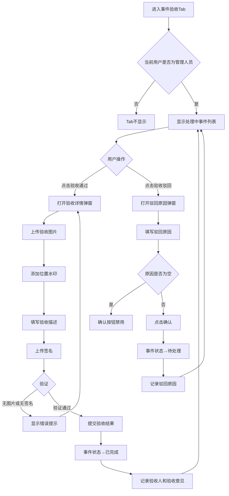

---
# 任务执行端PRD - 第五部分：随手拍清单与建筑垃圾管理

---

## 十三、随手拍清单

### 13.1 功能描述
展示所有随手拍事件记录，支持搜索、筛选、查看详情、图片预览等功能。

### 13.2 页面布局
- 顶部固定导航栏：返回按钮、标题"随手拍清单"
- 搜索框
- 筛选区域（状态、类型）
- 事件卡片列表
- 事件详情弹窗（Modal）
- 图片预览弹窗（Modal）

### 13.3 字段说明

#### 13.3.1 搜索与筛选区域

| 字段名称 | 字段类型 | 是否必填 | 默认值 | 说明 | 交互规则 |
|---------|---------|---------|-------|------|---------|
| 搜索关键词 | 输入框（文本） | 否 | 空 | 搜索事件标题、描述、位置 | 实时过滤列表 |
| 状态筛选 | 下拉框（Select） | 否 | 全部状态 | 按状态筛选 | 选项：全部/待处理/处理中/已完成/已驳回/拒不整改 |
| 类型筛选 | 下拉框（Select） | 否 | 全部类型 | 按事件类型筛选 | 选项：全部 + 12种事件类型 |

#### 13.3.2 事件卡片字段

| 字段名称 | 字段类型 | 是否必填 | 说明 | 备注 |
|---------|---------|---------|------|------|
| 事件标题 | 文本展示 | 是 | 事件名称 | 加粗显示 |
| 事件状态 | 标签（Badge） | 是 | 待处理/处理中/已完成/已驳回/拒不整改 | 不同状态不同颜色 |
| 事件描述 | 文本展示 | 否 | 事件详细描述 | 最多显示2行 |
| 事件类型 | 标签（Badge） | 是 | 事件所属类型 | 蓝色标签 |
| 事件位置 | 文本展示（带图标） | 是 | 事件发生地址 | 带定位图标 |
| 上报时间 | 文本展示 | 是 | 事件上报时间 | 格式：YYYY-MM-DD HH:mm |
| 上报人 | 文本展示 | 是 | 上报人姓名 | - |
| 事件图片 | 图片缩略图 | 否 | 最多显示3张，超出显示+N | 点击可放大预览 |

#### 13.3.3 事件详情弹窗字段

| 字段名称 | 字段类型 | 说明 | 备注 |
|---------|---------|------|------|
| 基本信息 | 文本展示 | 标题、状态、类型、位置、上报时间、上报人 | 只读 |
| 事件描述 | 文本展示 | 事件详细描述 | 只读 |
| 事件等级 | 文本展示 | 特急/急/一般 | 只读 |
| 整改方式 | 文本展示 | 限期整改/立即整改 | 只读 |
| 整改时限 | 文本展示 | 整改截止日期 | 只读 |
| 指派处理人 | 文本展示 | 负责处理的人员 | 只读 |
| 整改负责人 | 文本展示 | 实际整改的人员 | 有整改记录时显示 |
| 完成时间 | 文本展示 | 事件完成时间 | 状态为已完成时显示 |
| 验收人 | 文本展示 | 验收人姓名 | 状态为已完成/已驳回时显示 |
| 验收意见 | 文本展示 | 验收结果和意见 | 状态为已完成/已驳回时显示 |
| 事件图片 | 图片展示 | 所有事件相关图片（含整改图片） | 点击可放大预览 |

### 13.4 交互规则
1. 页面加载时显示所有事件记录，按上报时间倒序排列
2. 搜索框实时过滤，无需点击搜索按钮
3. 筛选条件变化时立即更新列表
4. 点击事件卡片打开事件详情弹窗
5. 详情弹窗中点击图片可放大预览，支持左右滑动切换
6. 状态标签颜色规则：
   - 待处理：黄色
   - 处理中：蓝色
   - 已完成：绿色
   - 已驳回：红色
   - 拒不整改：紫色

### 13.5 处理逻辑
1. 从localStorage或API加载事件列表
2. 过滤逻辑：同时满足搜索词、状态、类型三个条件
3. 图片预览：使用Modal展示大图，支持左右滑动切换

### 13.6 异常逻辑
1. 事件列表为空时：显示空状态提示（AlertCircle图标 + "暂无事件记录"）
2. 图片加载失败：显示占位图

### 13.7 流程图

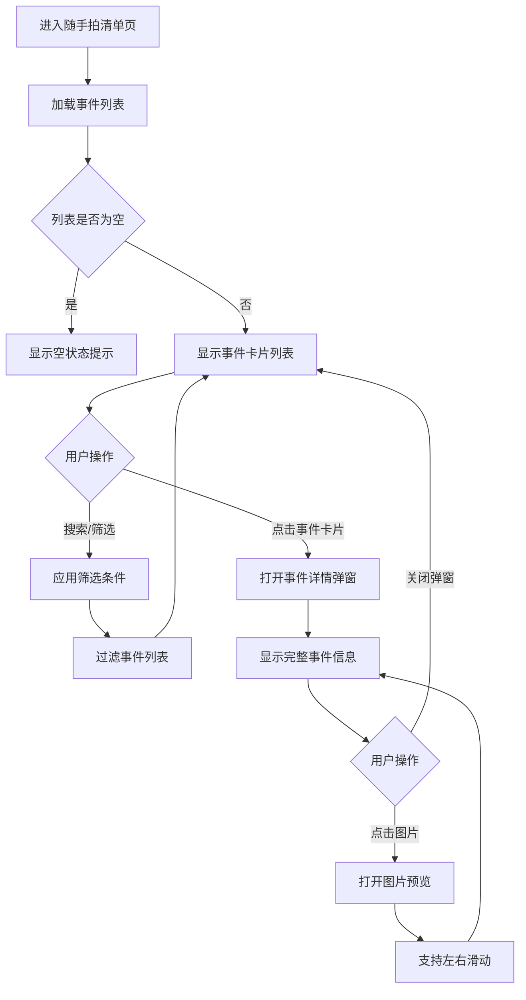

---

## 十四、建筑垃圾清运申请

### 14.1 功能描述
用于提交建筑垃圾清运申请，填写申请信息后等待审批，审批通过后生成二维码用于核销。

### 14.2 页面布局
- 顶部固定导航栏：返回按钮、标题"建筑垃圾清运申请"、返回主页按钮
- 申请列表（Tab切换：我的申请 / 新增申请）
- 申请卡片列表
- 新增申请表单
- 申请详情弹窗（Modal）
- 二维码展示弹窗（Modal）
- 路线查看弹窗（Modal）

### 14.3 字段说明

#### 14.3.1 申请卡片字段

| 字段名称 | 字段类型 | 是否必填 | 说明 | 备注 |
|---------|---------|---------|------|------|
| 申请ID | 文本展示 | 是 | 申请唯一标识 | 显示在卡片头部 |
| 申请状态 | 标签（Badge） | 是 | 待审批/已通过/已驳回 | 不同状态不同颜色 |
| 申请人姓名 | 文本展示 | 是 | 申请人姓名 | - |
| 申请人电话 | 文本展示 | 是 | 申请人联系电话 | - |
| 车牌号 | 文本展示 | 是 | 清运车辆车牌号 | - |
| 司机姓名 | 文本展示 | 是 | 司机姓名 | - |
| 起点位置 | 文本展示 | 是 | 建筑垃圾起点（施工点位） | - |
| 终点位置 | 文本展示 | 是 | 建筑垃圾终点（垃圾处理厂） | - |
| 垃圾类型 | 文本展示 | 是 | 建筑垃圾/装修垃圾/拆除垃圾 | - |
| 预估重量 | 文本展示 | 是 | 预估垃圾重量（吨） | - |
| 申请时间 | 文本展示 | 是 | 申请提交时间 | 格式：YYYY-MM-DD HH:mm |

#### 14.3.2 新增申请表单字段

| 字段名称 | 字段类型 | 是否必填 | 选项/格式 | 说明 | 交互规则 |
|---------|---------|---------|---------|------|---------|
| 申请人姓名 | 输入框（文本） | 是 | 文本 | 申请人姓名 | placeholder: "请输入申请人姓名" |
| 申请人电话 | 输入框（文本） | 是 | 手机号格式 | 申请人联系电话 | placeholder: "请输入申请人电话" |
| 车牌号 | 输入框（文本） | 是 | 车牌号格式 | 清运车辆车牌号 | placeholder: "请输入车牌号" |
| 司机姓名 | 输入框（文本） | 是 | 文本 | 司机姓名 | placeholder: "请输入司机姓名" |
| 司机电话 | 输入框（文本） | 是 | 手机号格式 | 司机联系电话 | placeholder: "请输入司机电话" |
| 起点位置 | 下拉框（Select） | 是 | 施工点位列表 | 建筑垃圾起点 | 从预设的施工点位列表中选择 |
| 终点位置 | 下拉框（Select） | 是 | 垃圾处理厂列表 | 建筑垃圾终点 | 从预设的垃圾处理厂列表中选择 |
| 垃圾类型 | 下拉框（Select） | 是 | 建筑垃圾/装修垃圾/拆除垃圾 | 垃圾类型 | 默认选择"建筑垃圾" |
| 预估重量 | 输入框（数字） | 是 | 数字，单位：吨 | 预估垃圾重量 | placeholder: "请输入预估重量（吨）" |
| 提交按钮 | 主要按钮 | - | - | 提交申请 | 必填字段为空时禁用 |

**施工点位选项**：
- 良渚街道建筑工地A
- 西湖区建筑工地B
- 江干区建筑工地C
- 余杭区建筑工地D
- 萧山区建筑工地E

**垃圾处理厂选项**：
- 余杭区垃圾处理厂
- 萧山区垃圾处理厂
- 临平区垃圾处理厂
- 西湖区垃圾处理厂
- 江干区垃圾处理厂

#### 14.3.3 申请详情弹窗字段

| 字段名称 | 字段类型 | 说明 | 备注 |
|---------|---------|------|------|
| 申请ID | 文本展示 | 申请唯一标识 | 只读 |
| 申请状态 | 标签（Badge） | 待审批/已通过/已驳回 | 只读 |
| 申请人信息 | 文本展示 | 姓名、电话 | 只读 |
| 车辆信息 | 文本展示 | 车牌号、司机姓名、司机电话 | 只读 |
| 路线信息 | 文本展示 | 起点、终点 | 只读 |
| 垃圾信息 | 文本展示 | 垃圾类型、预估重量 | 只读 |
| 申请时间 | 文本展示 | 申请提交时间 | 只读 |
| 审批信息 | 文本展示 | 审批结果、审批消息 | 有审批结果时显示 |
| 状态历史 | 时间线展示 | 申请的状态变更历史 | 只读 |

#### 14.3.4 操作按钮

| 按钮名称 | 显示条件 | 颜色 | 说明 |
|---------|---------|------|------|
| 查看详情 | 所有状态 | 蓝色 | 打开申请详情弹窗 |
| 查看二维码 | 状态=已通过 | 绿色 | 打开二维码展示弹窗 |
| 查看路线 | 所有状态 | 紫色 | 打开路线查看弹窗 |

### 14.4 交互规则
1. 页面默认显示"我的申请"Tab，展示当前用户的所有申请
2. 点击"新增申请"Tab切换到申请表单
3. 表单中所有必填字段为空时，提交按钮禁用
4. 提交申请后，申请状态为"待审批"，添加到申请列表
5. 点击"查看详情"打开申请详情弹窗，展示完整申请信息和状态历史
6. 审批通过后，点击"查看二维码"打开二维码展示弹窗，显示申请ID对应的二维码
7. 点击"查看路线"打开路线查看弹窗，显示起点到终点的路线地图（模拟）

### 14.5 处理逻辑
1. 申请提交：创建新的申请对象，状态为"pending"，添加到申请列表
2. 申请列表：从localStorage或API加载，按申请时间倒序排列
3. 二维码生成：使用申请ID生成二维码（使用在线二维码API）
4. 状态历史：记录申请的每次状态变更（提交、审批通过、审批驳回等）

### 14.6 异常逻辑
1. 必填字段为空时提交：显示错误提示"请填写所有必填字段"
2. 申请列表为空时：显示空状态提示
3. 二维码生成失败：显示错误提示

### 14.7 备注
- 审批功能在后台管理端实现，此处仅展示审批结果
- 二维码用于建筑垃圾核销功能

### 14.8 流程图

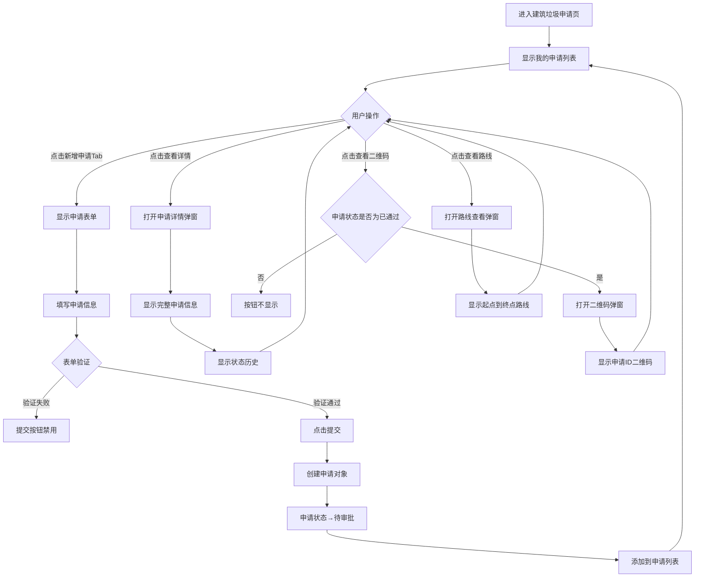

---

## 十五、建筑垃圾核销

### 15.1 功能描述
用于核销建筑垃圾清运申请，通过扫描申请方的二维码完成核销，并记录核销信息。

### 15.2 页面布局
- 顶部固定导航栏：返回按钮、标题"建筑垃圾核销"、返回主页按钮
- Tab切换栏：扫描二维码 / 核销记录
- 扫描二维码Tab：扫描区域、扫描结果展示
- 核销记录Tab：搜索筛选区域、核销记录列表

### 15.3 字段说明

#### 15.3.1 扫描二维码Tab

| 字段名称 | 字段类型 | 是否必填 | 说明 | 交互规则 |
|---------|---------|---------|------|---------|
| 扫描区域 | 扫描框 | - | 二维码扫描区域 | 显示扫描提示 |
| 开始扫描按钮 | 主要按钮 | - | 开始扫描二维码 | 点击后模拟扫描过程 |
| 扫描结果 | 文本展示 | - | 扫描到的申请ID | 扫描成功后显示 |

#### 15.3.2 扫描结果展示

| 字段名称 | 字段类型 | 说明 | 备注 |
|---------|---------|------|------|
| 申请ID | 文本展示 | 扫描到的申请ID | - |
| 核销状态 | 标签（Badge） | 核销成功/核销失败 | 绿色/红色 |
| 核销时间 | 文本展示 | 核销完成时间 | 格式：YYYY-MM-DD HH:mm:ss |

#### 15.3.3 核销记录Tab

**搜索筛选区域**：

| 字段名称 | 字段类型 | 是否必填 | 默认值 | 说明 | 交互规则 |
|---------|---------|---------|-------|------|---------|
| 搜索关键词 | 输入框（文本） | 否 | 空 | 搜索申请ID、申请人、车牌号、起点、终点 | 实时过滤列表 |
| 状态筛选 | 下拉框（Select） | 否 | 全部状态 | 按核销状态筛选 | 选项：全部/成功/失败 |
| 排序方式 | 下拉框（Select） | 否 | 时间（最新优先） | 排序方式 | 选项：时间（最新优先）/时间（最早优先） |

**核销记录卡片**：

| 字段名称 | 字段类型 | 是否必填 | 说明 | 备注 |
|---------|---------|---------|------|------|
| 核销ID | 文本展示 | 是 | 核销记录唯一标识 | 显示在卡片头部 |
| 核销状态 | 标签（Badge） | 是 | 成功/失败 | 绿色/红色 |
| 申请ID | 文本展示 | 是 | 对应的申请ID | - |
| 申请人姓名 | 文本展示 | 是 | 申请人姓名 | - |
| 车牌号 | 文本展示 | 是 | 清运车辆车牌号 | - |
| 起点位置 | 文本展示 | 是 | 建筑垃圾起点 | - |
| 终点位置 | 文本展示 | 是 | 建筑垃圾终点 | - |
| 核销时间 | 文本展示 | 是 | 核销完成时间 | 格式：YYYY-MM-DD HH:mm |

### 15.4 交互规则
1. 页面默认显示"扫描二维码"Tab
2. 点击"开始扫描"按钮，模拟扫描过程（1.5秒）
3. 扫描成功后显示扫描结果（申请ID、核销状态、核销时间）
4. 核销成功后自动添加到核销记录列表
5. 切换到"核销记录"Tab查看所有核销记录
6. 搜索和筛选实时过滤核销记录列表

### 15.5 处理逻辑
1. 二维码扫描：模拟扫描过程，返回申请ID（实际应使用二维码扫描库）
2. 核销验证：根据申请ID查找对应的申请，验证申请状态是否为"已通过"
3. 核销记录：创建核销记录对象，包含申请信息和核销时间
4. 核销记录列表：从localStorage或API加载，按核销时间倒序排列

### 15.6 异常逻辑
1. 扫描失败：显示错误提示"扫描失败，请重试"
2. 申请ID不存在：显示错误提示"申请不存在"
3. 申请状态不是"已通过"：显示错误提示"申请未通过审批，无法核销"
4. 核销记录为空时：显示空状态提示

### 15.7 流程图

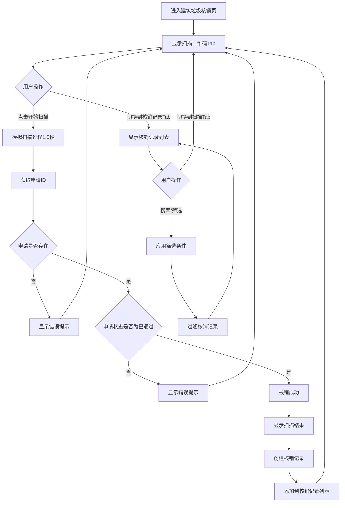

---

## 十六、附录

### 16.1 状态颜色规范

| 状态 | 颜色代码 | 背景色 | 文字色 | 使用场景 |
|------|---------|-------|-------|---------|
| 待处理 | yellow | #fef3c7 | #92400e | 任务、事件 |
| 进行中 | blue | #dbeafe | #1e40af | 任务、事件 |
| 已完成 | green | #d1fae5 | #065f46 | 任务、事件 |
| 已取消 | gray | #f3f4f6 | #374151 | 任务 |
| 已驳回 | red | #fee2e2 | #991b1b | 事件 |
| 拒不整改 | purple | #f3e8ff | #6b21a8 | 事件 |
| 待审批 | orange | #fed7aa | #9a3412 | 建筑垃圾申请 |
| 已通过 | green | #d1fae5 | #065f46 | 建筑垃圾申请 |

### 16.2 图标使用规范

| 功能 | 图标名称 | 来源 | 说明 |
|------|---------|------|------|
| 返回 | ArrowLeft | lucide-react | 导航栏左侧 |
| 搜索 | Search | lucide-react | 搜索框 |
| 筛选 | Filter | lucide-react | 筛选按钮 |
| 定位 | MapPin | lucide-react | 位置信息 |
| 日历 | Calendar | lucide-react | 日期选择 |
| 相机 | Camera | lucide-react | 拍照上传 |
| 图片 | Image | lucide-react | 相册选择 |
| 用户 | Users | lucide-react | 人员选择 |
| 时钟 | Clock | lucide-react | 时间信息 |
| 警告 | AlertTriangle | lucide-react | 警告提示 |
| 成功 | CheckCircle | lucide-react | 成功状态 |
| 关闭 | X | lucide-react | 关闭弹窗 |

### 16.3 字体规范

| 用途 | 字体大小 | 字重 | 颜色 |
|------|---------|------|------|
| 页面标题 | 18px | 700 | #111827 |
| 卡片标题 | 16px | 600 | #111827 |
| 正文 | 14px | 400 | #374151 |
| 辅助文字 | 12px | 400 | #6b7280 |
| 按钮文字 | 14px | 500 | #ffffff |

### 16.4 间距规范

| 用途 | 间距值 |
|------|-------|
| 页面边距 | 16px |
| 卡片间距 | 12px |
| 表单字段间距 | 16px |
| 按钮内边距 | 12px 24px |
| 卡片内边距 | 16px |

---

## 十七、总结

本PRD文档详细描述了城市管理系统任务执行端（小程序端）的所有功能模块，包括：

1. **入口与导航**：入口选择页面、任务执行端首页
2. **任务管理**：日常检查（我的任务）、任务详情与执行
3. **垃圾分类**：垃圾分类检查、检查记录列表
4. **事件管理**：随手拍（签到签退、事件上报、事件整改、事件验收）、随手拍清单
5. **建筑垃圾**：建筑垃圾清运申请、建筑垃圾核销

每个功能模块都包含了详细的字段描述、字段类型、交互规则、处理逻辑、异常逻辑和流程图，满足了PRD文档的完整性要求。

---
