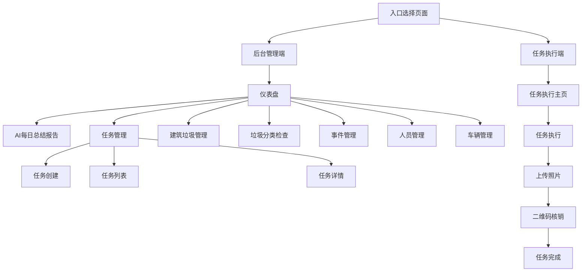

# 城市管理系统PRD文档

## 1. 产品概览

城市管理系统是一个综合性平台，旨在提升城市管理和序化管理的效率与透明度。系统分为后台管理端和任务执行端，实现了从任务创建、分配、执行到验收的全流程管理，同时提供AI智能分析和决策支持。

**主要功能/亮点**：
- 全流程任务管理：从创建到验收的完整生命周期管理
- 多维度数据统计：任务完成情况、隐患发现、垃圾分类、建筑垃圾报备、人员签到等
- AI智能分析：每日自动生成总结报告，提供关键洞察和改进建议
- 二维码核销：任务执行过程中的智能验证机制
- 实时监控：人员轨迹、任务进度的实时追踪
- 可视化数据展示：直观的图表和地图展示

**目标用户**：
- 城市管理部门工作人员
- 序化管理团队
- 任务执行人员
- 系统管理员

**应用场景**：
- 日常城市管理任务分配与执行
- 建筑垃圾运输与处理监控
- 垃圾分类检查与指导
- 城市环境隐患发现与整改
- 管理人员决策支持

## 2. 核心功能

### 2.1 功能模块

我们的城市管理系统包含以下主要页面：

1. **入口选择页面**：系统登录和角色选择
2. **后台管理端**：
   - 仪表盘：关键指标展示、数据卡片、AI总结报告入口
   - 任务管理：任务列表、任务创建、任务详情
   - 建筑垃圾管理：运输全链路监控
   - 垃圾分类检查：检查记录和统计
   - 事件管理：事件整改、验收、信访处理
   - 人员管理：人员信息和签到情况
   - 车辆管理：车辆信息和任务分配
   - AI每日总结报告：数据汇总和智能分析
3. **任务执行端**：
   - 任务执行主页：待执行任务列表
   - 任务详情：任务信息和执行状态
   - 车辆任务执行：实时轨迹和二维码核销

### 2.2 页面详情

| 页面名称 | 模块名称 | 功能描述 |
|---------|---------|--------|
| 入口选择页面 | 登录模块 | 提供系统登录和角色选择功能，区分后台管理端和任务执行端 |
| 仪表盘 | 关键指标展示 | 展示今日任务总数、待处理问题、完成率、事件数、整改率、验收率等关键指标 |
| 仪表盘 | 数据卡片 | 提供AI每日总结报告、建筑垃圾全链路管理、垃圾分类检查、随手拍案件、事件整改等功能入口 |
| 仪表盘 | 地图监控 | 显示城管团队和序化团队的实时位置和状态 |
| 任务管理 | 任务列表 | 展示所有任务的详细信息，支持搜索和筛选 |
| 任务管理 | 任务创建 | 提供表单用于创建新任务，包含任务名称、车辆、司机、垃圾类型等信息 |
| 任务管理 | 任务详情 | 展示任务的详细信息，包括基本信息、时间信息、路线信息和核销二维码 |
| 建筑垃圾管理 | 运输管理 | 监控建筑垃圾运输全流程，包括报备、运输中、已完成等状态 |
| 垃圾分类检查 | 检查记录 | 记录各区域垃圾分类检查情况，包括通过率、优秀/良好/不合格数量 |
| 事件管理 | 事件整改 | 跟踪各类问题的整改进度，支持查看事件详情 |
| 事件管理 | 事件验收 | 记录整改完成事件的验收结果，包括合格/不合格情况 |
| 事件管理 | 信访处理 | 管理市民信访案件的办理情况 |
| 人员管理 | 人员信息 | 管理城管和序化团队人员的基本信息和签到情况 |
| 车辆管理 | 车辆信息 | 管理车辆基本信息和任务分配情况 |
| AI每日总结报告 | 数据汇总 | 汇总任务完成情况、隐患发现情况、垃圾分类完成情况、建筑垃圾报备情况、人员签到情况 |
| AI每日总结报告 | 智能分析 | 提供AI生成的关键洞察和改进建议 |
| AI每日总结报告 | 报告下载 | 支持下载每日总结报告为文本文件 |
| 任务执行端 | 任务列表 | 展示待执行任务列表，支持按状态筛选 |
| 任务执行端 | 任务执行 | 实时追踪任务执行进度，包括位置轨迹和二维码核销 |

### 2.3 功能详细拆解

#### 2.3.1 任务管理 - 任务创建

| 字段名称 | 字段描述 | 输入/输出类型 | 交互规则 | 异常处理逻辑 | 备注 |
|---------|---------|------------|---------|-------------|------|
| 任务名称 | 任务的名称，用于标识任务 | 输入框 | 必填，长度限制50字符 | 为空时提示"请输入任务名称" | - |
| 车辆编号 | 执行任务的车辆编号 | 输入框 | 必填，长度限制20字符 | 为空时提示"请输入车辆编号" | - |
| 司机姓名 | 执行任务的司机姓名 | 输入框 | 必填，长度限制20字符 | 为空时提示"请输入司机姓名" | - |
| 垃圾类型 | 清运的垃圾类型 | 下拉框 | 必选，选项包括：渣土、装修垃圾、拆除垃圾 | 未选择时提示"请选择垃圾类型" | - |
| 重量 | 垃圾重量（吨） | 数字输入框 | 必填，大于0 | 为空或小于等于0时提示"请输入有效的重量" | - |
| 开始时间 | 任务开始时间 | 日期时间选择器 | 必填 | 为空时提示"请选择开始时间" | - |
| 结束时间 | 任务结束时间 | 日期时间选择器 | 必填，晚于开始时间 | 为空时提示"请选择结束时间"，早于开始时间时提示"结束时间必须晚于开始时间" | - |
| 起点 | 清运路线的起点 | 输入框 | 必填，长度限制50字符 | 为空时提示"请输入起点" | - |
| 终点 | 清运路线的终点 | 输入框 | 必填，长度限制50字符 | 为空时提示"请输入终点" | - |
| 路线预览 | 自动生成的路线预览 | 只读文本 | 自动生成 | - | 基于起点和终点自动生成 |
| 状态 | 任务状态 | 下拉框 | 默认为"待执行"，选项包括：待执行、进行中、已完成、已取消 | - | - |
| 提交按钮 | 提交任务创建表单 | 按钮 | 点击后提交表单 | 表单验证失败时阻止提交 | - |
| 取消按钮 | 取消任务创建 | 按钮 | 点击后关闭模态框 | - | - |

#### 2.3.2 任务管理 - 任务列表

| 字段名称 | 字段描述 | 输入/输出类型 | 交互规则 | 异常处理逻辑 | 备注 |
|---------|---------|------------|---------|-------------|------|
| 搜索框 | 搜索任务关键词 | 输入框 | 输入后实时筛选 | - | 支持按任务名称、车辆编号、司机姓名搜索 |
| 状态筛选 | 按任务状态筛选 | 下拉框 | 选择后筛选任务 | - | 选项包括：全部、待执行、进行中、已完成、已取消 |
| 任务名称 | 任务的名称 | 表格列 | 点击查看详情 | - | - |
| 车辆编号 | 执行任务的车辆编号 | 表格列 | - | - | - |
| 司机姓名 | 执行任务的司机姓名 | 表格列 | - | - | - |
| 垃圾类型 | 清运的垃圾类型 | 表格列 | - | - | - |
| 重量 | 垃圾重量（吨） | 表格列 | - | - | - |
| 开始时间 | 任务开始时间 | 表格列 | - | - | - |
| 结束时间 | 任务结束时间 | 表格列 | - | - | - |
| 状态 | 任务状态 | 表格列 | - | - | 显示不同颜色的状态标签 |
| 操作 | 任务操作按钮 | 表格列 | 包含查看、编辑、删除按钮 | 删除时弹出确认对话框 | - |
| 批量操作 | 批量删除等操作 | 按钮 | 选择多个任务后可执行 | 未选择任务时提示"请选择要操作的任务" | - |

#### 2.3.3 任务管理 - 任务详情

| 字段名称 | 字段描述 | 输入/输出类型 | 交互规则 | 异常处理逻辑 | 备注 |
|---------|---------|------------|---------|-------------|------|
| 任务基本信息 | 任务的基本信息 | 信息卡片 | 展示任务名称、车辆编号、司机姓名、垃圾类型、重量 | - | - |
| 时间信息 | 任务的时间信息 | 信息卡片 | 展示开始时间、结束时间、状态 | - | - |
| 路线信息 | 任务的路线信息 | 信息卡片 | 展示起点、终点、路线预览 | - | - |
| 核销二维码 | 用于任务核销的二维码 | 图片 | 展示二维码，可扫描 | - | 包含任务ID信息 |
| 关闭按钮 | 关闭详情模态框 | 按钮 | 点击后关闭模态框 | - | - |

#### 2.3.4 任务执行端 - 任务执行

| 字段名称 | 字段描述 | 输入/输出类型 | 交互规则 | 异常处理逻辑 | 备注 |
|---------|---------|------------|---------|-------------|------|
| 任务信息 | 任务的详细信息 | 信息卡片 | 展示任务名称、车辆编号、司机姓名、垃圾类型、重量、时间信息 | - | - |
| 地图界面 | 任务执行的地图 | 地图组件 | 显示车辆实时位置和路线 | - | 实际项目中集成地图API |
| 开始执行按钮 | 开始执行任务 | 按钮 | 点击后开始追踪位置 | 任务已开始时禁用 | - |
| 上传照片 | 上传现场照片 | 上传组件 | 支持上传多张照片 | 上传失败时提示错误信息 | 建议上传2-3张照片 |
| 二维码核销 | 任务核销二维码 | 图片 | 展示二维码，供扫描核销 | - | 任务完成时生成 |
| 完成任务按钮 | 完成任务 | 按钮 | 点击后完成任务 | 未上传照片时提示"请上传现场照片" | - |

#### 2.3.5 AI每日总结报告

| 字段名称 | 字段描述 | 输入/输出类型 | 交互规则 | 异常处理逻辑 | 备注 |
|---------|---------|------------|---------|-------------|------|
| 日期选择 | 选择报告日期 | 日期选择器 | 选择后加载对应日期的报告 | - | 默认为当天 |
| 任务完成情况 | 任务完成的统计数据 | 数据卡片 | 展示总任务数、已完成、待执行、进行中、完成率 | - | - |
| 隐患发现情况 | 隐患发现的统计数据 | 数据卡片 | 展示总隐患数、已解决、待处理、按类型分布 | - | - |
| 垃圾分类完成情况 | 垃圾分类检查的统计数据 | 数据卡片 | 展示总检查数、通过率、优秀、良好、不合格 | - | - |
| 建筑垃圾报备情况 | 建筑垃圾报备的统计数据 | 数据卡片 | 展示总报备数、已报备、运输中、已完成 | - | - |
| 人员签到情况 | 人员签到的统计数据 | 数据卡片 | 展示总人数、已签到、迟到、缺勤 | - | - |
| 关键洞察 | AI生成的关键洞察 | 列表 | 展示AI分析的关键问题和趋势 | - | - |
| 改进建议 | AI生成的改进建议 | 列表 | 展示AI提出的改进措施和建议 | - | - |
| 下载报告按钮 | 下载报告 | 按钮 | 点击后下载报告为文本文件 | - | - |
| 刷新按钮 | 刷新报告数据 | 按钮 | 点击后重新加载报告数据 | - | - |

#### 2.3.6 仪表盘 - 数据卡片

| 字段名称 | 字段描述 | 输入/输出类型 | 交互规则 | 异常处理逻辑 | 备注 |
|---------|---------|------------|---------|-------------|------|
| AI每日总结报告卡片 | AI每日总结报告入口 | 卡片 | 点击后跳转到AI每日总结报告页面 | - | - |
| 建筑垃圾全链路管理卡片 | 建筑垃圾管理入口 | 卡片 | 点击后跳转到建筑垃圾管理页面 | - | - |
| 垃圾分类检查卡片 | 垃圾分类检查入口 | 卡片 | 点击后跳转到垃圾分类检查页面 | - | - |
| 随手拍案件卡片 | 随手拍案件管理入口 | 卡片 | 点击后跳转到随手拍案件页面 | - | - |
| 事件整改卡片 | 事件整改管理入口 | 卡片 | 点击后跳转到事件整改页面 | - | - |
| 事件验收卡片 | 事件验收管理入口 | 卡片 | 点击后跳转到事件验收页面 | - | - |
| 信访处理卡片 | 信访处理管理入口 | 卡片 | 点击后跳转到信访处理页面 | - | - |
| 区域分布卡片 | 区域分布管理入口 | 卡片 | 点击后跳转到区域分布页面 | - | - |
| 职能分类占比卡片 | 职能分类管理入口 | 卡片 | 点击后跳转到职能分类页面 | - | - |

#### 2.3.7 仪表盘 - 关键指标

| 字段名称 | 字段描述 | 输入/输出类型 | 交互规则 | 异常处理逻辑 | 备注 |
|---------|---------|------------|---------|-------------|------|
| 今日任务总数 | 当日任务总数量 | 指标卡片 | 展示数字和趋势 | - | - |
| 待处理问题 | 待处理的问题数量 | 指标卡片 | 展示数字和趋势 | - | - |
| 完成率 | 任务完成率 | 指标卡片 | 展示百分比和趋势 | - | - |
| 事件数 | 当日事件数量 | 指标卡片 | 展示数字和趋势 | - | - |
| 整改率 | 事件整改率 | 指标卡片 | 展示百分比和趋势 | - | - |
| 验收率 | 事件验收率 | 指标卡片 | 展示百分比和趋势 | - | - |

#### 2.3.8 仪表盘 - 地图监控

| 字段名称 | 字段描述 | 输入/输出类型 | 交互规则 | 异常处理逻辑 | 备注 |
|---------|---------|------------|---------|-------------|------|
| 模拟地图 | 城市地图 | 地图组件 | 显示人员点位和轨迹 | - | 实际项目中集成地图API |
| 人员点位 | 人员实时位置 | 标记 | 显示不同状态的人员位置 | - | 颜色区分状态：在线、离线、忙碌 |
| 轨迹线 | 人员移动轨迹 | 线条 | 显示人员历史移动轨迹 | - | - |
| 控制面板 | 地图控制 | 面板 | 支持缩放、拖动、筛选 | - | - |
| 人员选择 | 选择人员查看轨迹 | 下拉框 | 选择后显示对应人员轨迹 | - | - |
| 轨迹回放 | 回放人员轨迹 | 按钮 | 点击后回放轨迹 | - | - |

#### 2.3.9 建筑垃圾管理 - 运输管理

| 字段名称 | 字段描述 | 输入/输出类型 | 交互规则 | 异常处理逻辑 | 备注 |
|---------|---------|------------|---------|-------------|------|
| 任务列表 | 建筑垃圾运输任务列表 | 表格 | 展示任务详情 | - | - |
| 任务名称 | 任务的名称 | 表格列 | 点击查看详情 | - | - |
| 车辆编号 | 执行任务的车辆编号 | 表格列 | - | - | - |
| 司机姓名 | 执行任务的司机姓名 | 表格列 | - | - | - |
| 垃圾类型 | 清运的垃圾类型 | 表格列 | - | - | - |
| 重量 | 垃圾重量（吨） | 表格列 | - | - | - |
| 开始时间 | 任务开始时间 | 表格列 | - | - | - |
| 结束时间 | 任务结束时间 | 表格列 | - | - | - |
| 状态 | 任务状态 | 表格列 | - | - | 显示不同颜色的状态标签 |
| 路线信息 | 任务路线 | 表格列 | - | - | - |
| 操作 | 任务操作按钮 | 表格列 | 包含查看、编辑、删除按钮 | - | - |

#### 2.3.10 垃圾分类检查 - 检查记录

| 字段名称 | 字段描述 | 输入/输出类型 | 交互规则 | 异常处理逻辑 | 备注 |
|---------|---------|------------|---------|-------------|------|
| 检查记录列表 | 垃圾分类检查记录 | 表格 | 展示检查详情 | - | - |
| 检查时间 | 检查的时间 | 表格列 | - | - | - |
| 检查地点 | 检查的地点 | 表格列 | - | - | - |
| 检查人员 | 执行检查的人员 | 表格列 | - | - | - |
| 检查结果 | 检查的结果 | 表格列 | - | - | 显示优秀/良好/不合格标签 |
| 通过率 | 垃圾分类通过率 | 表格列 | - | - | - |
| 问题描述 | 发现的问题 | 表格列 | - | - | - |
| 整改建议 | 整改建议 | 表格列 | - | - | - |
| 操作 | 记录操作按钮 | 表格列 | 包含查看、编辑、删除按钮 | - | - |

#### 2.3.11 事件管理 - 事件整改

| 字段名称 | 字段描述 | 输入/输出类型 | 交互规则 | 异常处理逻辑 | 备注 |
|---------|---------|------------|---------|-------------|------|
| 事件列表 | 事件整改列表 | 表格 | 展示事件详情 | - | - |
| 事件ID | 事件的唯一标识 | 表格列 | - | - | - |
| 事件类型 | 事件的类型 | 表格列 | - | - | - |
| 事件描述 | 事件的描述 | 表格列 | - | - | - |
| 发生地点 | 事件发生的地点 | 表格列 | - | - | - |
| 发生时间 | 事件发生的时间 | 表格列 | - | - | - |
| 整改状态 | 整改的状态 | 表格列 | - | - | 显示不同颜色的状态标签 |
| 整改进度 | 整改的进度 | 表格列 | 显示进度条 | - | - |
| 操作 | 事件操作按钮 | 表格列 | 包含查看、编辑、删除按钮 | - | - |

#### 2.3.12 事件管理 - 事件验收

| 字段名称 | 字段描述 | 输入/输出类型 | 交互规则 | 异常处理逻辑 | 备注 |
|---------|---------|------------|---------|-------------|------|
| 验收列表 | 事件验收列表 | 表格 | 展示验收详情 | - | - |
| 事件ID | 事件的唯一标识 | 表格列 | - | - | - |
| 事件类型 | 事件的类型 | 表格列 | - | - | - |
| 事件描述 | 事件的描述 | 表格列 | - | - | - |
| 整改时间 | 整改完成的时间 | 表格列 | - | - | - |
| 验收时间 | 验收的时间 | 表格列 | - | - | - |
| 验收结果 | 验收的结果 | 表格列 | - | - | 显示合格/不合格标签 |
| 验收人员 | 执行验收的人员 | 表格列 | - | - | - |
| 操作 | 验收操作按钮 | 表格列 | 包含查看、编辑、删除按钮 | - | - |

#### 2.3.13 事件管理 - 信访处理

| 字段名称 | 字段描述 | 输入/输出类型 | 交互规则 | 异常处理逻辑 | 备注 |
|---------|---------|------------|---------|-------------|------|
| 信访列表 | 信访处理列表 | 表格 | 展示信访详情 | - | - |
| 信访ID | 信访的唯一标识 | 表格列 | - | - | - |
| 信访人 | 信访人的姓名 | 表格列 | - | - | - |
| 联系方式 | 信访人的联系方式 | 表格列 | - | - | - |
| 信访内容 | 信访的内容 | 表格列 | - | - | - |
| 提交时间 | 信访提交的时间 | 表格列 | - | - | - |
| 处理状态 | 处理的状态 | 表格列 | - | - | 显示不同颜色的状态标签 |
| 处理时间 | 处理的时间 | 表格列 | - | - | - |
| 操作 | 信访操作按钮 | 表格列 | 包含查看、编辑、删除按钮 | - | - |

#### 2.3.14 人员管理 - 人员信息

| 字段名称 | 字段描述 | 输入/输出类型 | 交互规则 | 异常处理逻辑 | 备注 |
|---------|---------|------------|---------|-------------|------|
| 人员列表 | 人员信息列表 | 表格 | 展示人员详情 | - | - |
| 姓名 | 人员的姓名 | 表格列 | - | - | - |
| 工号 | 人员的工号 | 表格列 | - | - | - |
| 部门 | 人员所属部门 | 表格列 | - | - | - |
| 职位 | 人员的职位 | 表格列 | - | - | - |
| 联系方式 | 人员的联系方式 | 表格列 | - | - | - |
| 签到状态 | 今日签到状态 | 表格列 | - | - | 显示已签到/未签到/迟到标签 |
| 操作 | 人员操作按钮 | 表格列 | 包含查看、编辑、删除按钮 | - | - |

#### 2.3.15 车辆管理 - 车辆信息

| 字段名称 | 字段描述 | 输入/输出类型 | 交互规则 | 异常处理逻辑 | 备注 |
|---------|---------|------------|---------|-------------|------|
| 车辆列表 | 车辆信息列表 | 表格 | 展示车辆详情 | - | - |
| 车辆编号 | 车辆的编号 | 表格列 | - | - | - |
| 车辆类型 | 车辆的类型 | 表格列 | - | - | - |
| 所属部门 | 车辆所属部门 | 表格列 | - | - | - |
| 司机姓名 | 车辆的司机 | 表格列 | - | - | - |
| 车辆状态 | 车辆的状态 | 表格列 | - | - | 显示可用/维修中/已报废标签 |
| 上次维护 | 上次维护时间 | 表格列 | - | - | - |
| 操作 | 车辆操作按钮 | 表格列 | 包含查看、编辑、删除按钮 | - | - |

#### 2.3.16 任务执行端 - 任务列表

| 字段名称 | 字段描述 | 输入/输出类型 | 交互规则 | 异常处理逻辑 | 备注 |
|---------|---------|------------|---------|-------------|------|
| 任务列表 | 待执行任务列表 | 卡片列表 | 展示任务详情 | - | - |
| 任务卡片 | 单个任务信息 | 卡片 | 点击查看详情并执行 | - | - |
| 任务名称 | 任务的名称 | 卡片内容 | - | - | - |
| 车辆编号 | 执行任务的车辆编号 | 卡片内容 | - | - | - |
| 司机姓名 | 执行任务的司机姓名 | 卡片内容 | - | - | - |
| 垃圾类型 | 清运的垃圾类型 | 卡片内容 | - | - | - |
| 开始时间 | 任务开始时间 | 卡片内容 | - | - | - |
| 状态 | 任务状态 | 卡片内容 | - | - | 显示不同颜色的状态标签 |
| 执行按钮 | 开始执行任务 | 按钮 | 点击后进入任务执行页面 | - | - |
| 状态筛选 | 按任务状态筛选 | 下拉框 | 选择后筛选任务 | - | 选项包括：全部、待执行、进行中、已完成 |

## 3. Core Process

### 3.1 后台管理端流程

1. **系统登录**：用户通过入口页面登录系统，选择后台管理端角色
2. **仪表盘查看**：登录后进入仪表盘，查看关键指标和数据卡片
3. **任务管理**：
   - 创建新任务：填写任务信息，系统自动生成二维码
   - 查看任务列表：浏览和筛选任务
   - 查看任务详情：查看任务详细信息和二维码
4. **其他管理功能**：
   - 建筑垃圾管理：监控运输全流程
   - 垃圾分类检查：查看检查记录和统计
   - 事件管理：处理事件整改、验收和信访
   - 人员管理：管理人员信息和签到情况
   - 车辆管理：管理车辆信息和任务分配
5. **AI每日总结报告**：
   - 查看每日汇总数据
   - 分析AI生成的洞察和建议
   - 下载报告

### 3.2 任务执行端流程

1. **系统登录**：用户通过入口页面登录系统，选择任务执行端角色
2. **任务列表查看**：查看待执行任务列表
3. **任务执行**：
   - 开始执行任务：实时追踪位置
   - 上传现场照片：在终点上传照片
   - 二维码核销：生成并扫描二维码完成任务
4. **任务完成**：确认任务完成，更新状态

### 3.3 AI每日总结报告流程

1. **数据收集**：系统自动收集当日任务数据、隐患数据、垃圾分类数据、建筑垃圾数据和人员签到数据
2. **数据处理**：对收集的数据进行统计和分析
3. **报告生成**：生成包含数据汇总、关键洞察和改进建议的每日报告
4. **报告查看**：用户通过仪表盘入口访问报告
5. **报告下载**：支持下载报告为文本文件



## 4. 用户接口设计

### 4.1 设计风格

**颜色方案**：
- 主色调：深蓝色 (#0a1628, #081c2f, #0d1b2a)
- 强调色：青色 (#00e5ff)、绿色 (#00ffb2)、紫色 (#7b61ff)
- 状态颜色：绿色 (已完成)、黄色 (进行中)、蓝色 (待处理)、红色 (错误/警告)
- 文本颜色：白色、浅灰色、深灰色

**布局风格**：
- 响应式网格布局
- 卡片式设计
- 深色主题，现代科技感
- 渐变背景和光效
- 流畅的动画过渡

**字体**：
- 无衬线字体，清晰易读
- 标题：粗体，较大字号
- 正文：常规字重，中等字号
- 辅助文字：较小字号，浅灰色

**图标**：
- 使用Lucide React图标库
- 简洁、现代的线条图标
- 与功能相关的直观图标

### 4.2 页面设计概览

| 页面名称 | 模块名称 | UI元素 |
|---------|---------|-------|
| 入口选择页面 | 登录模块 | 渐变背景、登录表单、角色选择按钮、品牌标识 |
| 仪表盘 | 关键指标展示 | 卡片式布局、数字指标、趋势箭头、图标 |
| 仪表盘 | 数据卡片 | 网格布局、卡片悬停效果、图标、描述文字 |
| 仪表盘 | 地图监控 | 模拟地图、人员点位标记、轨迹线、控制面板 |
| 任务管理 | 任务列表 | 表格布局、搜索框、筛选器、操作按钮 |
| 任务管理 | 任务创建 | 表单布局、输入字段、下拉选择、提交按钮 |
| 任务管理 | 任务详情 | 模态框、标签页、信息卡片、二维码展示 |
| 建筑垃圾管理 | 运输管理 | 表格布局、状态标签、路线信息、车辆信息 |
| 垃圾分类检查 | 检查记录 | 表格布局、通过率指标、等级标签 |
| 事件管理 | 事件整改 | 表格布局、进度条、状态标签、详情按钮 |
| 事件管理 | 事件验收 | 表格布局、验收结果标签、验收时间 |
| 事件管理 | 信访处理 | 表格布局、处理状态、处理时间 |
| 人员管理 | 人员信息 | 表格布局、签到状态、联系方式 |
| 车辆管理 | 车辆信息 | 表格布局、车辆状态、任务分配 |
| AI每日总结报告 | 数据汇总 | 卡片式布局、图表、进度条、数字指标 |
| AI每日总结报告 | 智能分析 | 列表布局、图标、文本内容 |
| AI每日总结报告 | 报告下载 | 按钮、文件格式选择 |
| 任务执行端 | 任务列表 | 卡片式布局、状态标签、执行按钮 |
| 任务执行端 | 任务执行 | 地图界面、位置标记、照片上传、二维码展示 |

### 4.3 自适应

**设计原则**：
- 桌面优先设计，同时支持平板和移动设备
- 响应式布局，根据屏幕尺寸自动调整
- 关键功能在所有设备上保持可访问性
- 触控友好的界面元素，适合移动设备操作

**断点设计**：
- 桌面端：1200px及以上
- 平板端：768px - 1199px
- 移动端：767px及以下

**适配策略**：
- 桌面端：多列布局，充分利用屏幕空间
- 平板端：减少列数，调整元素大小
- 移动端：单列布局，简化界面，优化触控体验

## 5. 技术实现

### 5.1 技术栈

- **前端框架**：React 18
- **开发语言**：TypeScript
- **构建工具**：Vite
- **样式方案**：Tailwind CSS
- **路由管理**：React Router
- **状态管理**：React Context API
- **图标库**：Lucide React
- **数据可视化**：Recharts (计划使用)
- **二维码生成**：外部API (api.qrserver.com)

### 5.2 核心功能实现

**任务管理**：
- 任务创建：表单提交，自动生成任务ID和二维码
- 任务列表：表格展示，支持搜索和筛选
- 任务详情：模态框展示，包含二维码和详细信息

**AI每日总结报告**：
- 数据收集：模拟数据生成，实际项目中可对接后端API
- 数据处理：前端计算和统计
- 报告生成：基于模板生成结构化报告
- 报告下载：生成文本文件并下载

**二维码核销**：
- 二维码生成：使用外部API生成包含任务ID的二维码
- 二维码展示：在任务详情和执行页面展示
- 二维码验证：模拟验证过程，实际项目中可对接后端验证

**实时监控**：
- 人员轨迹：模拟位置数据，实际项目中可对接GPS API
- 任务状态：实时更新任务执行状态
- 地图展示：使用SVG模拟地图，实际项目中可集成地图API

### 5.3 项目结构

```
src/
├── components/          # 通用组件
│   ├── AIConversationModal.tsx
│   ├── Empty.tsx
│   └── ImageUploader.tsx
├── contexts/            # 上下文管理
│   └── authContext.ts
├── hooks/               # 自定义钩子
│   ├── usePeople.ts
│   └── useTheme.ts
├── lib/                 # 工具库
│   └── utils.ts
├── pages/               # 页面组件
│   ├── components/      # 页面级组件
│   ├── AIDailySummaryPage.tsx
│   ├── DashboardPage.tsx
│   ├── TaskListPage.tsx
│   ├── WasteTransportTaskListPage.tsx
│   └── ...
├── routes/              # 路由配置
│   └── index.tsx
├── App.tsx              # 应用入口
├── main.tsx             # 主渲染文件
└── index.css            # 全局样式
```

## 6. 未来规划

### 6.1 功能扩展

- **智能预测**：基于历史数据预测任务量和资源需求
- **自动调度**：根据任务优先级和人员位置自动分配任务
- **智能识别**：使用图像识别技术自动识别垃圾分类和环境问题
- **多端同步**：支持PC、平板、手机等多终端同步
- **数据大屏**：为指挥中心提供实时数据大屏

### 6.2 技术优化

- **后端API对接**：替换模拟数据，对接真实后端API
- **数据库集成**：使用数据库存储和管理数据
- **性能优化**：优化渲染性能和数据加载速度
- **安全加固**：增强系统安全性，防止未授权访问
- **测试覆盖**：增加单元测试和集成测试

### 6.3 集成扩展

- **第三方服务集成**：集成地图API、天气API等
- **消息通知**：添加短信、邮件等通知功能
- **报表导出**：支持导出Excel、PDF等格式的报表
- **API开放**：提供开放API，支持与其他系统集成
- **移动端App**：开发专用的移动端应用

## 7. 总结

城市管理系统是一个功能完备、界面美观、技术先进的综合性平台，旨在提升城市管理和序化管理的效率与透明度。系统通过全流程任务管理、多维度数据统计、AI智能分析、二维码核销、实时监控和可视化数据展示等功能，为城市管理工作提供了全方位的支持。

系统采用现代化的技术栈和设计理念，具有良好的扩展性和可维护性。未来，通过功能扩展、技术优化和集成扩展，可以进一步提升系统的能力和价值，为城市管理工作带来更多便利和效益。