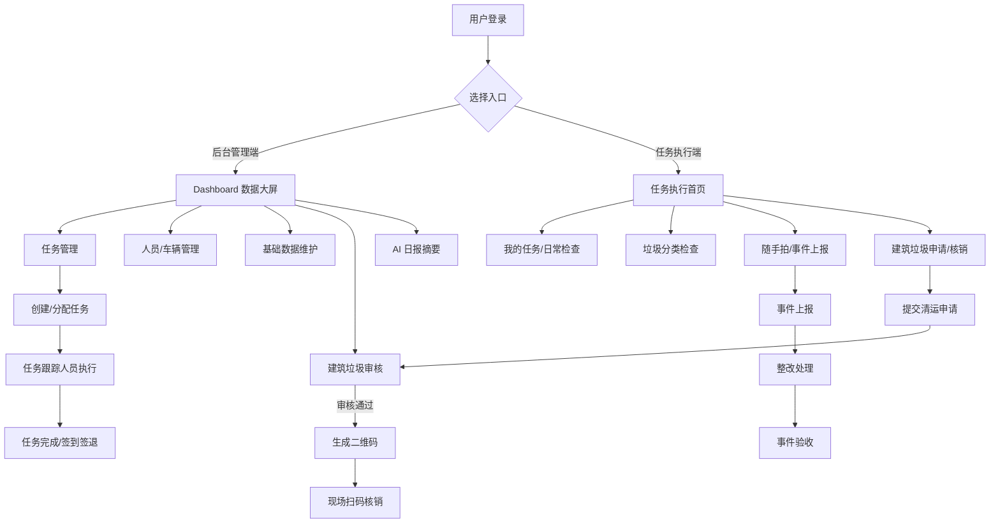
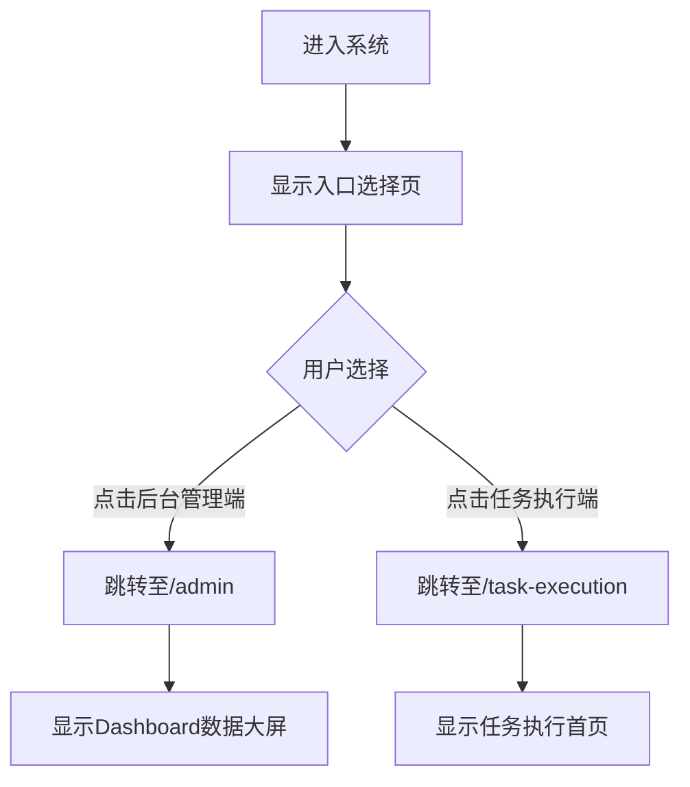
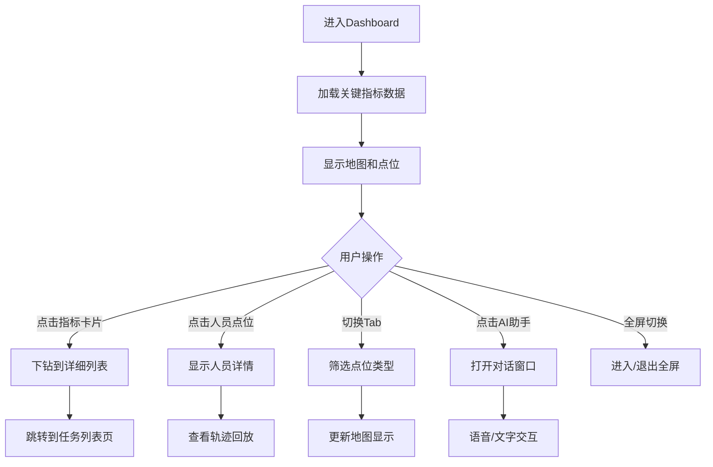
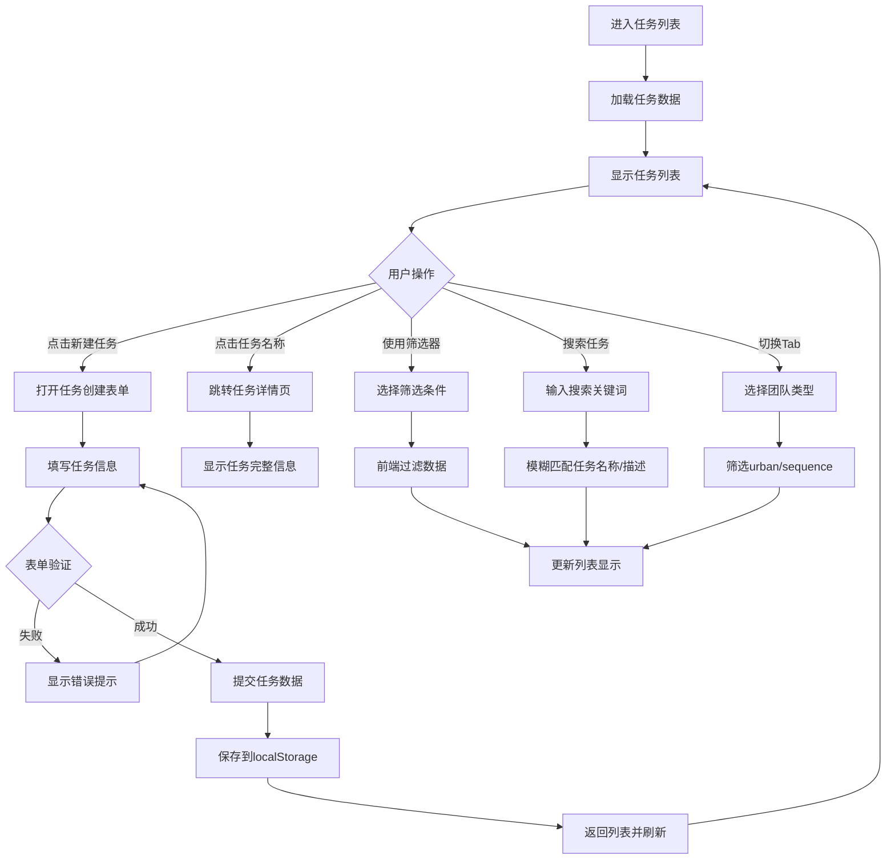
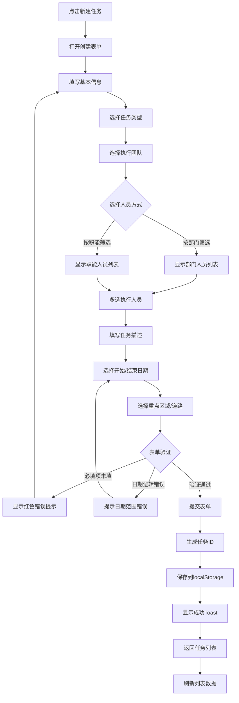
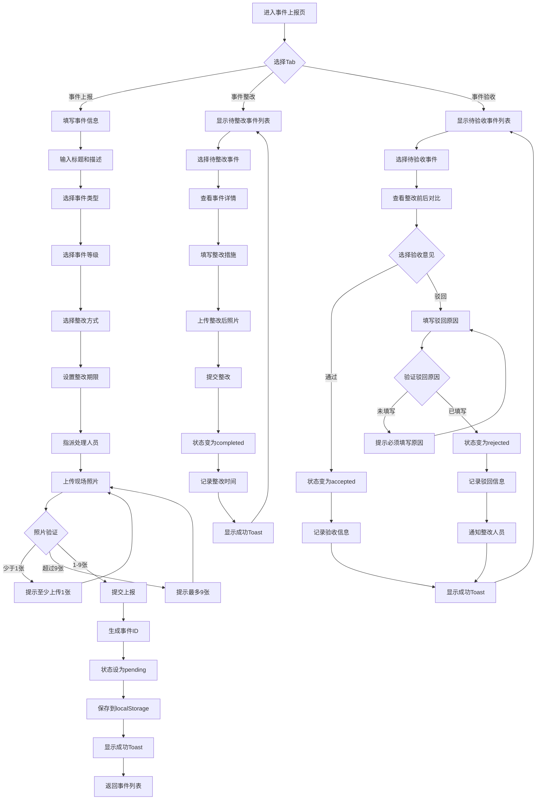
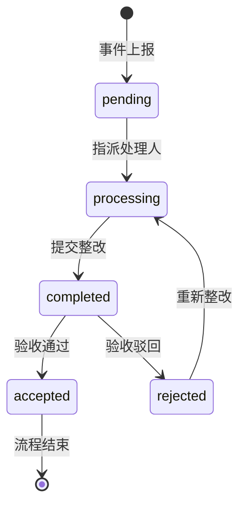

# 城市管理系统产品需求文档（PRD）增强版

**版本号**: v3.0  
**最后更新**: 2026-04-17  
**文档状态**: 已完成  
**新增内容**: 完整流程图 + UI原型描述

---

## 目录

1. [文档概述](#1-文档概述)
2. [功能模块详细设计](#2-功能模块详细设计)
   - 2.1 [入口选择模块](#21-入口选择模块)
   - 2.2 [管理后台首页](#22-管理后台首页)
   - 2.3 [任务管理模块](#23-任务管理模块)
   - 2.4 [事件上报模块](#24-事件上报模块)
   - 2.5 [人员管理模块](#25-人员管理模块)
   - 2.6 [车辆管理模块](#26-车辆管理模块)
   - 2.7 [基础数据维护模块](#27-基础数据维护模块)
   - 2.8 [垃圾分类检查模块](#28-垃圾分类检查模块)
   - 2.9 [车辆任务执行模块](#29-车辆任务执行模块)
   - 2.10 [建筑垃圾清运管理模块](#210-建筑垃圾清运管理模块)
   - 2.11 [任务执行端首页](#211-任务执行端首页)
   - 2.12 [AI日报摘要模块](#212-ai日报摘要模块)
   - 2.13 [我的任务模块](#213-我的任务模块)
   - 2.14 [随手拍清单模块](#214-随手拍清单模块)
3. [技术架构说明](#3-技术架构说明)
4. [附录](#4-附录)

---

## 1. 文档概述

### 1.1 产品定位
城市管理系统是一款面向城市管理执法人员的综合性管理平台，覆盖日常巡查、事件上报、任务分配、车辆管理、人员管理、垃圾分类检查、建筑垃圾清运管理等多个业务场景，实现城市管理工作的数字化、智能化。

### 1.2 用户角色
| 角色 | 描述 | 主要职能 |
|------|------|----------|
| 管理人员 | 城管团队/序化团队的队长等管理层 | 事件上报、任务分配、人员管理、事件验收、建筑垃圾审核 |
| 任务跟踪人员 | 一线执法人员、队员 | 日常巡查、任务执行、垃圾分类检查、随手拍上报、建筑垃圾清运 |

### 1.3 整体业务流程图


---

## 2. 功能模块详细设计

## 2.1 入口选择模块

### 2.1.1 功能描述
提供系统入口选择，区分后台管理端和任务执行端两个独立的工作台。

### 2.1.2 页面元素
| 字段名称 | 字段类型 | 是否必填 | 交互规则 | 处理逻辑 | 异常逻辑 | 备注 |
|----------|----------|----------|----------|----------|----------|------|
| 后台管理端入口 | 卡片按钮 | - | 点击跳转至/admin 路由 | 导航至管理后台首页 | - | 图标：盾牌 Icon，颜色：蓝色系 |
| 任务执行端入口 | 卡片按钮 | - | 点击跳转至/task-execution 路由 | 导航至任务执行首页 | - | 图标：公文包 Icon，颜色：绿色系 |

### 2.1.3 交互流程图


### 2.1.4 UI原型描述

**页面布局**:
- 渐变背景: from-blue-50 to-indigo-100
- 居中布局，最大宽度 md (28rem)
- 顶部标题区域 + 两个卡片垂直排列

**标题区域**:
```
┌─────────────────────────────────┐
│      城市管理系统                │
│   请选择登录入口                 │
└─────────────────────────────────┘
```

**后台管理端卡片**:
```
┌─────────────────────────────────┐
│         [盾牌图标]               │
│                                 │
│      后台管理端                  │
│  系统管理、数据分析、任务分配     │
└─────────────────────────────────┘
```
- 白色背景，圆角 2xl
- 蓝色图标圆形背景 (bg-blue-100)
- Hover 效果: scale(1.03) + 蓝色边框

**任务执行端卡片**:
```
┌─────────────────────────────────┐
│       [公文包图标]               │
│                                 │
│      任务执行端                  │
│ 日常检查、垃圾分类、随手拍、事件处理│
└─────────────────────────────────┘
```
- 白色背景，圆角 2xl
- 绿色图标圆形背景 (bg-green-100)
- Hover 效果: scale(1.03) + 绿色边框

---

## 2.2 管理后台首页（DashboardPage）

### 2.2.1 功能描述
管理后台的数据可视化大屏，展示关键指标、地图点位、人员轨迹、任务统计等信息。

### 2.2.2 页面元素及字段定义

#### 2.2.2.1 关键指标卡片
| 字段名称 | 字段类型 | 是否必填 | 交互规则 | 处理逻辑 | 异常逻辑 | 备注 |
|----------|----------|----------|----------|----------|----------|------|
| 总任务数 | 数值 + 单位 | 是 | 点击可下钻查看任务列表 | 从任务统计数据中聚合计算 | 数据为空时显示 0 | 带趋势箭头（up/down/stable） |
| 待处理任务数 | 数值 + 单位 | 是 | 点击筛选出待处理任务 | 筛选 status='pending'的任务 | - | - |
| 完成率 | 百分比 | 是 | 点击跳转已完成任务 | completed 任务数/总任务数*100% | - | 保留 1 位小数 |
| 事件总数 | 数值 + 单位 | 是 | 点击下钻事件列表 | 从隐患上报数据聚合 | - | - |
| 整改率 | 百分比 | 是 | - | 已整改事件数/总事件数*100% | - | - |
| 验收率 | 百分比 | 是 | - | 验收通过数/已完成事件数*100% | - | - |

### 2.2.3 Dashboard交互流程图


### 2.2.4 UI原型描述

**页面布局**:
```
┌────────────────────────────────────────────────────────┐
│ [返回] 城市管理驾驶舱        [AI助手] [全屏] [时间]    │
├────────────────────────────────────────────────────────┤
│ ┌──────┐ ┌──────┐ ┌──────┐ ┌──────┐ ┌──────┐ ┌──────┐│
│ │总任务│ │待处理│ │完成率│ │事件数│ │整改率│ │验收率││
│ │ 120 │ │  15  │ │ 79% │ │  25  │ │ 94% │ │ 88% ││
│ └──────┘ └──────┘ └──────┘ └──────┘ └──────┘ └──────┘│
├────────────────────────────────────────────────────────┤
│ [全部] [城管团队] [序化团队]                           │
│ ┌────────────────────────────────────────────────────┐│
│ │                                                    ││
│ │              地图区域 (可拖拽/缩放)                 ││
│ │         ● 张队员 (online, 3任务)                   ││
│ │              ● 李队员 (busy, 5任务)                ││
│ │                   ● 王队员 (offline)               ││
│ │                                                    ││
│ └────────────────────────────────────────────────────┘│
│ [轨迹回放控制] ▶ ⏸ ⏹ ━━━━━━━━━━━ 60%                │
└────────────────────────────────────────────────────────┘
```

**关键指标卡片样式**:
- 渐变背景: from-[#0e2a47] to-[#0a1f3a]
- 边框: border-[#1e4976]
- 数值颜色: text-[#00e5ff]
- Hover 效果: shadow-[#00e5ff]/20

**地图点位标记**:
- Online: 绿色圆点 + 脉冲动画
- Busy: 黄色圆点
- Offline: 灰色圆点
- 点击显示: 姓名、状态、任务数

---

## 2.3 任务管理模块

### 2.3.1 任务列表页面（TaskListPage）

#### 2.3.1.1 功能描述
展示所有任务列表，支持多条件筛选、搜索、分页，可创建新任务。

#### 2.3.1.2 字段定义
[保留原有字段定义表格]

#### 2.3.1.3 任务列表完整流程图


#### 2.3.1.4 任务创建流程图


#### 2.3.1.5 UI原型描述

**任务列表页面布局**:
```
┌────────────────────────────────────────────────────────┐
│ [返回] 任务列表                          [新建任务]     │
├────────────────────────────────────────────────────────┤
│ [全部] [城管团队] [序化团队]                           │
├────────────────────────────────────────────────────────┤
│ [搜索框]  [任务类型▼] [状态▼] [人员▼] [区域▼] [道路▼]│
├────────────────────────────────────────────────────────┤
│ ┌────────────────────────────────────────────────────┐│
│ │ 沿街店铺专项整治任务 1          [待处理] 2026-04-20││
│ │ 执行人: 张三 | 城市管理团队                        ││
│ │ 地址: 测试路1号                                    ││
│ └────────────────────────────────────────────────────┘│
│ ┌────────────────────────────────────────────────────┐│
│ │ 流动摊贩专项整治任务 2          [进行中] 2026-04-21││
│ │ 执行人: 李四 | 序化管理团队                        ││
│ │ 地址: 测试路2号                                    ││
│ └────────────────────────────────────────────────────┘│
│                                                        │
│ [上一页] 1 2 3 4 5 [下一页]                           │
└────────────────────────────────────────────────────────┘
```

**任务创建表单布局**:
```
┌────────────────────────────────────────────────────────┐
│ [×] 新建任务                                           │
├────────────────────────────────────────────────────────┤
│ 任务名称 *                                             │
│ [_____________________________________]                │
│                                                        │
│ 任务类型 * [沿街店铺 ▼]  职能分类 [市政保洁 ▼]        │
│                                                        │
│ 执行团队 * ○ 城市管理团队  ○ 序化管理团队              │
│                                                        │
│ 执行人员 * [选择人员...]                               │
│ ┌────────────────────────────────────────────────────┐│
│ │ [按部门] [按职能]                                  ││
│ │ ☑ 张三 (城管团队)                                  ││
│ │ ☐ 李四 (城管团队)                                  ││
│ │ ☐ 王五 (序化团队)                                  ││
│ └────────────────────────────────────────────────────┘│
│                                                        │
│ 任务描述 *                                             │
│ [_____________________________________]                │
│ [_____________________________________]                │
│                                                        │
│ 开始日期 * [2026-04-20]  结束日期 * [2026-04-27]      │
│                                                        │
│ 重点区域 [永旺梦乐城 ▼]  主要道路 [古墩路 ▼]          │
│                                                        │
│ 地址 [_____________________________________]           │
│                                                        │
│              [取消]  [保存任务]                        │
└────────────────────────────────────────────────────────┘
```

**状态标签颜色**:
- 待处理: bg-yellow-100 text-yellow-800
- 进行中: bg-blue-100 text-blue-800
- 已完成: bg-green-100 text-green-800
- 已取消: bg-gray-100 text-gray-800

---

## 2.4 事件上报模块（HazardReportingPage）

### 2.4.1 功能描述
支持随手拍上报事件、事件整改、事件验收三个核心流程。

### 2.4.2 事件上报完整流程图


### 2.4.3 事件状态流转图


### 2.4.4 UI原型描述

**事件上报Tab布局**:
```
┌────────────────────────────────────────────────────────┐
│ [返回] 事件上报                                        │
├────────────────────────────────────────────────────────┤
│ [事件上报] [事件整改] [事件验收]                       │
├────────────────────────────────────────────────────────┤
│ 事件标题 *                                             │
│ [_____________________________________]                │
│                                                        │
│ 事件描述 *                                             │
│ [_____________________________________]                │
│ [_____________________________________]                │
│                                                        │
│ 事件位置 * [_____________________] [📍定位]           │
│                                                        │
│ 事件类型 * [广告牌 ▼]  事件等级 * [一般事件 ▼]        │
│                                                        │
│ 整改方式 * [立即整改 ▼]  整改期限 * [2026-04-22]      │
│                                                        │
│ 指派人员 * [选择人员 ▼]                                │
│                                                        │
│ 现场照片 * (至少1张，最多9张)                          │
│ ┌───┐ ┌───┐ ┌───┐ ┌───┐                              │
│ │📷 │ │ + │ │   │ │   │                              │
│ └───┘ └───┘ └───┘ └───┘                              │
│                                                        │
│                    [提交上报]                          │
└────────────────────────────────────────────────────────┘
```

**事件整改Tab布局**:
```
┌────────────────────────────────────────────────────────┐
│ [返回] 事件整改                                        │
├────────────────────────────────────────────────────────┤
│ [事件上报] [事件整改] [事件验收]                       │
├────────────────────────────────────────────────────────┤
│ 待整改事件列表                                         │
│ ┌────────────────────────────────────────────────────┐│
│ │ 小区垃圾桶满溢                    [处理中] 2天前   ││
│ │ 类型: 广告牌 | 位置: 3号楼前                       ││
│ │ 整改期限: 2026-04-22                               ││
│ │                                    [开始整改]      ││
│ └────────────────────────────────────────────────────┘│
│                                                        │
│ === 整改表单 ===                                       │
│ 整改负责人 * [李四 ▼]                                  │
│                                                        │
│ 整改措施 *                                             │
│ [_____________________________________]                │
│ [_____________________________________]                │
│                                                        │
│ 整改后照片 * (至少1张)                                 │
│ ┌───┐ ┌───┐ ┌───┐                                    │
│ │📷 │ │ + │ │   │                                    │
│ └───┘ └───┘ └───┘                                    │
│                                                        │
│                    [提交整改]                          │
└────────────────────────────────────────────────────────┘
```

**事件验收Tab布局**:
```
┌────────────────────────────────────────────────────────┐
│ [返回] 事件验收                                        │
├────────────────────────────────────────────────────────┤
│ [事件上报] [事件整改] [事件验收]                       │
├────────────────────────────────────────────────────────┤
│ 待验收事件列表                                         │
│ ┌────────────────────────────────────────────────────┐│
│ │ 小区垃圾桶满溢                    [已完成] 1天前   ││
│ │ 整改人: 李四 | 完成时间: 2026-04-16 15:40          ││
│ │                                    [开始验收]      ││
│ └────────────────────────────────────────────────────┘│
│                                                        │
│ === 整改前后对比 ===                                   │
│ 整改前照片              整改后照片                     │
│ ┌─────────┐            ┌─────────┐                   │
│ │  [图片]  │            │  [图片]  │                   │
│ └─────────┘            └─────────┘                   │
│                                                        │
│ 验收人 * [王五 ▼]                                      │
│                                                        │
│ 验收意见 * ○ 通过  ○ 驳回                              │
│                                                        │
│ 驳回原因 (选择驳回时必填)                              │
│ [_____________________________________]                │
│                                                        │
│              [提交验收]                                │
└────────────────────────────────────────────────────────┘
```

---

