# 城市管理系统 - 管理后台端 产品需求文档（PRD）

**文档版本**：v1.0  
**创建日期**：2026-04-17  
**产品名称**：城市管理系统 - 管理后台端  
**目标平台**：PC Web 端

---

## 一、文档概述

### 1.1 产品定位
管理后台端面向城市管理部门的管理人员，提供任务分配、人员管理、数据分析、建筑垃圾全链路管控、举报事件处理、基础数据维护等综合管理能力。

### 1.2 用户角色
- **系统管理员**：拥有所有功能权限
- **管理人员**：可进行任务创建、人员管理、事件处理、数据查看等操作

### 1.3 核心功能模块
| 序号 | 模块名称 | 路由 | 说明 |
|------|---------|------|------|
| 1 | 后台管理首页 | /admin | 功能导航中心 |
| 2 | 城市管理驾驶舱 | /dashboard | 综合数据看板 |
| 3 | 任务管理 | /task-list | 任务列表与创建 |
| 4 | 人员管理 | /people-management | 人员信息维护 |
| 5 | 车辆管理 | /vehicle-management | 车辆信息维护 |
| 6 | 建筑垃圾全链路管理 | /construction-waste | 清运任务/点位/车辆备案/审批 |
| 7 | 举报与事件处理 | /report-management | 市民举报处理 |
| 8 | 统计分析 | /statistics | 多维度数据统计 |
| 9 | 基础数据维护 | /basic-data-maintenance | 道路/公厕/绿化数据 |

---

## 二、整体业务流程图

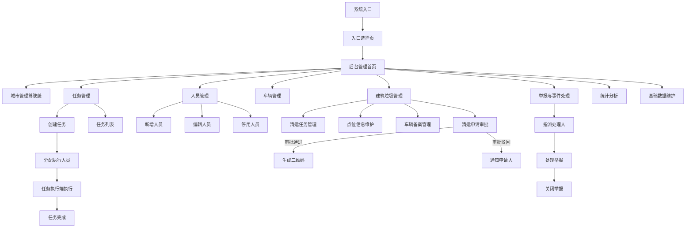

---

## 三、后台管理首页

### 3.1 功能描述
后台管理端的导航中心，以卡片形式展示所有功能模块入口，方便管理人员快速进入各功能。

### 3.2 页面布局
- 顶部：标题"后台管理端"、副标题"系统管理、数据分析、任务分配"、当前日期（含星期）
- 主体：功能卡片网格（3列布局）
- 底部：版权信息和返回入口选择链接

### 3.3 功能卡片列表

| 功能名称 | 图标 | 颜色主题 | 跳转路径 | 说明 |
|---------|------|---------|---------|------|
| 城市管理驾驶舱 | Activity | 蓝色 | /dashboard | 综合展示任务完成情况 |
| 人员管理 | Users | 靛蓝色 | /people-management | 维护系统用户和工作人员信息 |
| 任务管理 | ClipboardList | 绿色 | /task-list | 查看和管理巡查任务 |
| 建筑垃圾管理 | Truck | 琥珀色 | /construction-waste | 管理清运司机、车辆、路线等 |
| 举报与事件处理 | MessageCircle | 红色 | /report-management | 查看和处理市民举报的事件 |
| 统计分析 | BarChart3 | 紫色 | /statistics | 查看各类统计数据 |

### 3.4 交互规则
1. 卡片悬停时放大1.02倍，有过渡动画
2. 点击卡片跳转到对应功能页面
3. 顶部右侧显示当前日期（格式：YYYY年MM月DD日 星期X）
4. 底部"返回入口选择"链接返回 `/`

### 3.5 流程图

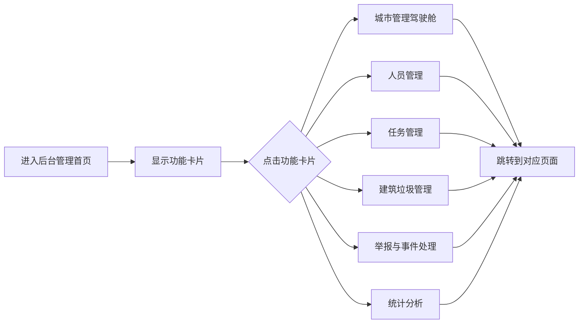

---

## 四、城市管理驾驶舱

### 4.1 功能描述
综合数据看板，展示城市管理的关键指标、人员地图分布、轨迹回放、任务完成情况等，支持数据下钻查看详情。

### 4.2 页面布局
- 顶部工具栏：返回按钮、标题、时间范围选择、全屏切换、刷新、下载、AI对话入口
- 关键指标卡片区（4个核心指标）
- 地图区域（人员位置分布 + 轨迹回放）
- 数据卡片区（任务完成、事件处理、垃圾分类等）
- 下钻详情面板（点击数据卡片后展开）

### 4.3 字段说明

#### 4.3.1 顶部工具栏

| 字段名称 | 字段类型 | 是否必填 | 默认值 | 说明 | 交互规则 |
|---------|---------|---------|-------|------|---------|
| 时间范围 | 下拉框（Select） | 否 | 今天 | 选择数据时间范围 | 选项：今天/昨天/本周/自定义；选择"自定义"时显示开始/结束时间输入框 |
| 自定义开始时间 | 日期时间选择器 | 条件必填 | 空 | 自定义时间范围起始 | 仅在时间范围选"自定义"时显示 |
| 自定义结束时间 | 日期时间选择器 | 条件必填 | 空 | 自定义时间范围结束 | 仅在时间范围选"自定义"时显示 |
| 搜索关键词 | 输入框（文本） | 否 | 空 | 搜索人员或任务 | 实时过滤地图标注 |
| Tab切换 | 标签页（Tab） | 否 | 全部 | 切换显示团队 | 选项：全部/城管团队/序化团队 |

#### 4.3.2 关键指标卡片

| 指标名称 | 字段类型 | 说明 | 备注 |
|---------|---------|------|------|
| 今日任务总数 | 数字展示 | 当日任务总量 | 带趋势箭头（上升/下降/持平） |
| 任务完成率 | 百分比展示 | 已完成/总任务 | 带趋势百分比 |
| 事件上报数 | 数字展示 | 当日上报事件数 | 带趋势箭头 |
| 整改完成率 | 百分比展示 | 已整改/总事件 | 带趋势百分比 |

#### 4.3.3 地图区域

| 字段名称 | 字段类型 | 说明 | 交互规则 |
|---------|---------|------|---------|
| 地图底图 | 图片展示 | 区域路线地图 | 支持缩放（鼠标滚轮）和拖拽 |
| 人员标注点 | 地图标注 | 显示人员当前位置 | 城管团队蓝色/序化团队绿色；点击显示人员信息 |
| 人员状态 | 标注颜色 | 在线/离线/忙碌 | 绿色=在线，灰色=离线，橙色=忙碌 |
| 轨迹线 | 折线展示 | 选中人员的历史轨迹 | 选中人员后显示 |
| 缩放控制 | 按钮组 | +/- 缩放地图 | 点击放大/缩小 |

#### 4.3.4 轨迹回放控制面板

| 字段名称 | 字段类型 | 是否必填 | 说明 | 交互规则 |
|---------|---------|---------|------|---------|
| 选择人员 | 下拉框（Select） | 是 | 选择要回放轨迹的人员 | 选择后加载该人员轨迹数据 |
| 播放/暂停 | 按钮 | - | 控制轨迹回放 | 点击切换播放/暂停状态 |
| 进度条 | 滑块（Slider） | - | 显示回放进度 | 可拖拽跳转到指定时间点 |
| 当前时间点 | 文本展示 | - | 当前回放的时间 | 随回放自动更新 |
| 当前动作 | 文本展示 | - | 当前时间点的操作记录 | 随回放自动更新 |

#### 4.3.5 数据卡片区

| 卡片名称 | 展示内容 | 点击行为 |
|---------|---------|---------|
| 任务完成情况 | 各状态任务数量（待处理/进行中/已完成/已取消） | 下钻展示任务列表 |
| 事件处理情况 | 各状态事件数量 | 下钻展示事件列表 |
| 垃圾分类检查 | 检查次数、平均分 | 下钻展示检查记录 |
| 人员出勤情况 | 签到人数、签退人数 | 下钻展示人员出勤列表 |

#### 4.3.6 下钻详情面板

| 字段名称 | 字段类型 | 说明 | 交互规则 |
|---------|---------|------|---------|
| 面板标题 | 文本展示 | 当前下钻的数据类型 | 动态显示 |
| 搜索框 | 输入框（文本） | 搜索下钻数据 | 实时过滤 |
| 筛选条件 | 下拉框组 | 多维度筛选 | 根据数据类型动态显示 |
| 数据列表 | 表格 | 展示详细数据 | 支持排序 |
| 关闭按钮 | 按钮 | 关闭下钻面板 | 点击关闭，返回主看板 |

### 4.4 交互规则
1. 页面加载时自动获取当前时间并显示
2. 时间范围切换后自动刷新所有数据
3. 地图支持鼠标滚轮缩放（0.5x ~ 3x）和拖拽移动
4. 点击地图上的人员标注点，显示该人员信息弹窗（姓名、状态、当前任务数）
5. 点击数据卡片触发下钻，展示详细数据列表
6. 下钻面板支持拖拽移动位置
7. 点击"AI对话"按钮打开AI对话弹窗，可询问数据分析问题
8. 全屏按钮切换浏览器全屏模式

### 4.5 处理逻辑
1. 关键指标：从API获取当日统计数据，计算趋势（与昨日对比）
2. 地图标注：从API获取所有在线人员的位置信息，按团队分类显示
3. 轨迹回放：根据选择的人员和时间范围，获取轨迹数据，按时间顺序播放
4. 数据下钻：点击卡片后请求对应的详细数据列表

### 4.6 异常逻辑
1. 数据加载失败：显示错误提示，提供重试按钮
2. 地图加载失败：显示占位图，提示"地图加载失败"
3. 无轨迹数据：提示"该时间段内无轨迹记录"
4. 下钻数据为空：显示空状态提示

### 4.7 流程图

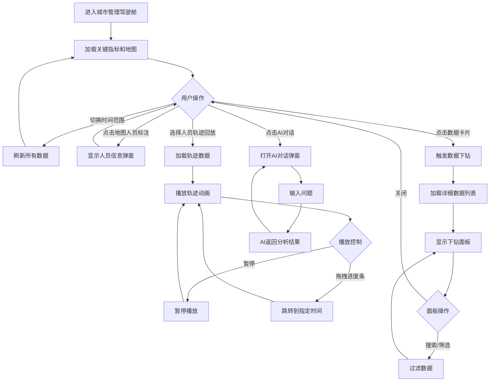

---
# 管理后台端PRD - 第二部分：任务管理、人员管理、车辆管理

---

## 五、任务管理

### 5.1 功能描述
管理员可查看所有任务列表，支持多维度筛选、创建新任务、查看任务详情，并可导出任务数据。

### 5.2 页面布局
- 顶部导航栏：返回按钮、标题"任务管理"
- 搜索与筛选区域
- 任务列表（表格/卡片形式）
- 新建任务按钮（跳转到任务创建页）
- 任务详情弹窗（Modal）

### 5.3 字段说明

#### 5.3.1 搜索与筛选区域

| 字段名称 | 字段类型 | 是否必填 | 默认值 | 说明 | 交互规则 |
|---------|---------|---------|-------|------|---------|
| 搜索关键词 | 输入框（文本） | 否 | 空 | 搜索任务名称、描述、地址 | 实时过滤列表 |
| 任务类型 | 下拉框（Select） | 否 | 全部 | 按任务类型筛选 | 立即过滤 |
| 执行团队 | 下拉框（Select） | 否 | 全部 | 按团队筛选 | 立即过滤 |
| 任务状态 | 下拉框（Select） | 否 | 全部 | 按状态筛选 | 立即过滤 |
| 职能分类 | 下拉框（Select） | 否 | 全部 | 按职能分类筛选 | 立即过滤 |

**任务类型选项**：沿街店铺、流动摊贩、市政设施、人行道违停、工地管理、出店经营、广告牌、违挡、垃圾分类、环境卫生

**执行团队选项**：城市管理团队、序化管理团队

**任务状态选项**：待处理、进行中、已完成、已取消

**职能分类（城管团队）**：市政保洁、市政绿化、垃圾分类、渣土管理

**职能分类（序化团队）**：流动摊贩、违章建筑、地铁口管理、车辆违停、其它

#### 5.3.2 任务列表字段

| 字段名称 | 字段类型 | 是否必填 | 说明 | 备注 |
|---------|---------|---------|------|------|
| 任务名称 | 文本展示 | 是 | 任务标题 | 可点击查看详情 |
| 任务类型 | 标签（Badge） | 是 | 任务所属类型 | 彩色标签 |
| 职能分类 | 文本展示 | 是 | 职能分类名称 | - |
| 重点区域 | 文本展示 | 否 | 任务所在重点区域 | - |
| 主要道路 | 文本展示 | 否 | 任务所在主要道路 | - |
| 执行团队 | 文本展示 | 是 | 城市管理团队/序化管理团队 | - |
| 执行人员 | 文本展示 | 是 | 负责人姓名（多人用逗号分隔） | - |
| 任务状态 | 标签（Badge） | 是 | 待处理/进行中/已完成/已取消 | 不同颜色 |
| 开始日期 | 文本展示 | 是 | 格式：YYYY-MM-DD | - |
| 截止日期 | 文本展示 | 是 | 格式：YYYY-MM-DD | - |
| 任务地址 | 文本展示 | 是 | 任务执行地址 | - |
| 创建时间 | 文本展示 | 是 | 任务创建时间 | - |
| 操作 | 按钮组 | - | 查看详情、编辑、删除 | - |

#### 5.3.3 任务详情弹窗

展示任务的完整信息，包括基本信息、执行人员列表、任务描述、执行结果（如有）。

### 5.4 交互规则
1. 页面加载时显示所有任务，按创建时间倒序排列
2. 搜索和筛选实时过滤列表
3. 点击任务名称或"查看详情"按钮打开详情弹窗
4. 点击"新建任务"按钮跳转到任务创建页面（/task-create）
5. 点击"导出"按钮导出当前筛选结果为CSV/Excel

### 5.5 异常逻辑
1. 任务列表为空：显示空状态提示
2. 删除任务时弹出确认对话框，防止误操作

### 5.6 流程图

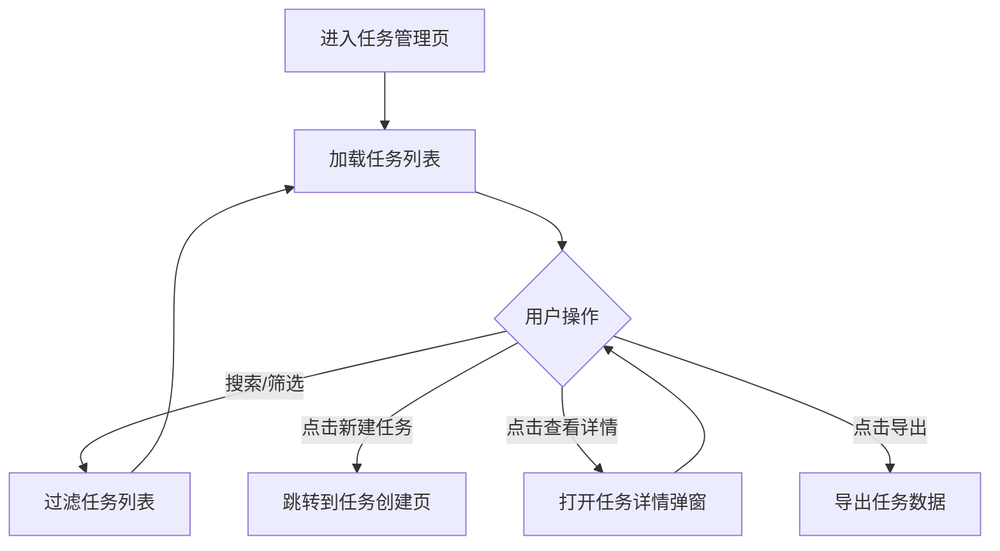

---

## 六、任务创建

### 6.1 功能描述
管理员创建新的巡查任务，填写任务基本信息、选择执行人员，支持按部门或职能分类筛选人员。

### 6.2 页面布局
- 顶部导航栏：返回按钮、标题"创建任务"
- 任务基本信息表单
- 人员选择弹窗（Modal）
- 底部操作按钮（保存/取消）

### 6.3 字段说明

#### 6.3.1 任务基本信息表单

| 字段名称 | 字段类型 | 是否必填 | 选项/格式 | 说明 | 交互规则 | 备注 |
|---------|---------|---------|---------|------|---------|------|
| 任务名称 | 输入框（文本） | 是 | 文本，最多100字 | 任务标题 | 为空时提交报错 | placeholder: "请输入任务名称" |
| 任务类型 | 下拉框（Select） | 是 | 见任务类型列表 | 任务所属类型 | 选择后可联动筛选人员 | 10种类型 |
| 任务描述 | 多行文本框（Textarea） | 否 | 文本，最多500字 | 任务详细描述 | - | placeholder: "请输入任务描述" |
| 执行团队 | 下拉框（Select） | 是 | 城市管理团队/序化管理团队 | 执行团队 | 选择人员后自动推断填充 | 可手动修改 |
| 执行人员 | 人员选择器（Picker） | 是 | 人员列表（多选） | 负责执行的人员 | 点击弹出人员选择弹窗；支持多选 | 至少选1人 |
| 任务地址 | 输入框（文本） | 是 | 文本地址 | 任务执行地址 | - | placeholder: "请输入任务地址" |
| 开始日期 | 日期选择器（date） | 是 | YYYY-MM-DD | 任务开始日期 | - | - |
| 截止日期 | 日期选择器（date） | 是 | YYYY-MM-DD | 任务截止日期 | 不能早于开始日期 | - |

#### 6.3.2 人员选择弹窗

| 字段名称 | 字段类型 | 是否必填 | 说明 | 交互规则 |
|---------|---------|---------|------|---------|
| 筛选方式 | 单选按钮组（Radio） | 否 | 按部门/按职能分类 | 切换筛选维度 |
| 部门筛选 | 复选框组（Checkbox） | 否 | 选择部门 | 筛选方式为"按部门"时显示 |
| 职能分类筛选 | 复选框组（Checkbox） | 否 | 选择职能分类 | 筛选方式为"按职能分类"时显示 |
| 人员列表 | 复选框列表 | 是 | 显示符合筛选条件的活跃人员 | 勾选即选中该人员 |
| 全选按钮 | 按钮 | - | 全选当前筛选结果 | 点击全选当前列表所有人员 |
| 取消全选 | 按钮 | - | 取消全选 | 点击取消当前列表所有人员的选中 |
| 已选人数 | 文本展示 | - | 显示已选人员数量 | 实时更新 |
| 确认按钮 | 主要按钮 | - | 确认选择 | 关闭弹窗，更新执行人员字段 |
| 取消按钮 | 次要按钮 | - | 取消选择 | 关闭弹窗，不更新 |

**部门选项**：城管团队、序化管理团队

**职能分类选项**：沿街店铺、流动摊贩、市政设施、人行道违停、工地管理、出店经营、广告牌、违挡、垃圾分类、环境卫生

### 6.4 交互规则
1. 选择任务类型后，打开人员选择弹窗时自动切换到"按职能分类"筛选，并预选对应职能分类
2. 选择人员后，根据第一个人员的部门自动推断并填充"执行团队"字段
3. 表单验证：必填字段为空时，对应字段显示红色边框和错误提示
4. 截止日期早于开始日期时，显示错误提示"截止日期不能早于开始日期"
5. 提交成功后跳转回任务列表页，显示成功提示

### 6.5 处理逻辑
1. 人员列表：从usePeople Hook获取所有活跃人员（isActive=true）
2. 按职能分类筛选：匹配人员的functionType数组中包含所选职能分类名称的人员
3. 表单提交：创建任务对象，调用API保存，成功后跳转

### 6.6 异常逻辑
1. 必填字段为空时提交：显示字段级错误提示，阻止提交
2. 截止日期早于开始日期：显示错误提示
3. 未选择执行人员：显示错误提示"请至少选择一位执行人员"
4. API提交失败：显示错误提示，保留表单内容

### 6.7 流程图

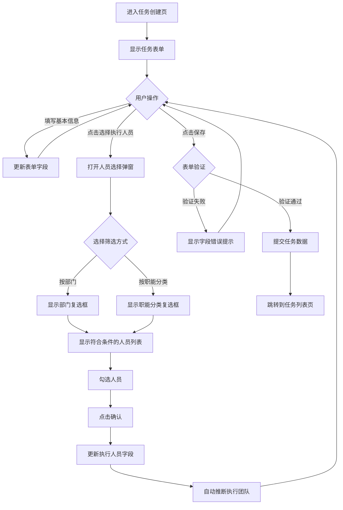

---

## 七、人员管理

### 7.1 功能描述
维护系统中所有工作人员的基本信息，支持新增、编辑、停用/启用人员，并可按部门和关键词筛选。

### 7.2 页面布局
- 顶部导航栏：返回按钮、标题"人员管理"
- 搜索与筛选区域
- 人员列表（表格形式）
- 新增人员按钮
- 新增/编辑人员弹窗（Modal）

### 7.3 字段说明

#### 7.3.1 搜索与筛选区域

| 字段名称 | 字段类型 | 是否必填 | 默认值 | 说明 | 交互规则 |
|---------|---------|---------|-------|------|---------|
| 搜索关键词 | 输入框（文本） | 否 | 空 | 搜索姓名、电话、邮箱 | 实时过滤 |
| 部门筛选 | 下拉框（Select） | 否 | 全部 | 按部门筛选 | 立即过滤 |

#### 7.3.2 人员列表字段

| 字段名称 | 字段类型 | 是否必填 | 说明 | 备注 |
|---------|---------|---------|------|------|
| 姓名 | 文本展示 | 是 | 人员姓名 | - |
| 部门 | 文本展示 | 是 | 所属部门 | - |
| 职位 | 文本展示 | 是 | 职位名称 | - |
| 人员类型 | 标签（Badge） | 是 | 管理人员/任务跟踪人员 | 不同颜色区分 |
| 职能分类 | 标签组 | 否 | 负责的职能分类（多个） | 多个标签展示 |
| 联系电话 | 文本展示 | 是 | 手机号码 | - |
| 邮箱 | 文本展示 | 否 | 电子邮箱 | - |
| 状态 | 标签（Badge） | 是 | 在职/停用 | 绿色=在职，灰色=停用 |
| 操作 | 按钮组 | - | 编辑、停用/启用 | - |

#### 7.3.3 新增/编辑人员弹窗字段

| 字段名称 | 字段类型 | 是否必填 | 选项/格式 | 说明 | 交互规则 | 备注 |
|---------|---------|---------|---------|------|---------|------|
| 姓名 | 输入框（文本） | 是 | 文本，最多20字 | 人员姓名 | 为空时提交报错 | placeholder: "请输入姓名" |
| 部门 | 下拉框（Select） | 是 | 城管团队/序化管理团队 | 所属部门 | 为空时提交报错 | - |
| 职位 | 输入框（文本） | 是 | 文本 | 职位名称 | 为空时提交报错 | placeholder: "如：队员、队长" |
| 人员类型 | 下拉框（Select） | 是 | 任务跟踪人员/管理人员 | 人员角色类型 | 默认"任务跟踪人员" | 影响小程序端权限 |
| 联系电话 | 输入框（文本） | 是 | 手机号格式 | 联系电话 | 为空时提交报错 | placeholder: "请输入手机号" |
| 邮箱 | 输入框（文本） | 否 | 邮箱格式 | 电子邮箱 | - | placeholder: "请输入邮箱" |
| 职能分类 | 复选框组（Checkbox） | 否 | 12种职能分类 | 负责的职能分类（多选） | 可多选 | 用于任务分配时筛选人员 |
| 状态 | 复选框（Checkbox） | 是 | 在职/停用 | 人员状态 | 默认勾选（在职） | - |

**职能分类选项**：广告牌、违挡、沿街店铺、城市绿化、墙体倒塌、修路开挖、流动摊贩、地铁口管理、人行道违停、出店经营、工地、市政设施安全巡查

### 7.4 交互规则
1. 页面加载时从localStorage或API加载人员列表
2. 搜索和筛选实时过滤列表
3. 点击"新增人员"按钮打开新增弹窗，表单重置为默认值
4. 点击"编辑"按钮打开编辑弹窗，表单预填当前人员数据
5. 点击"停用"按钮弹出确认对话框，确认后将人员状态改为停用
6. 停用的人员在任务分配时不会出现在可选列表中
7. 提交成功后关闭弹窗，刷新列表，显示成功提示

### 7.5 处理逻辑
1. 数据持久化：人员数据保存到localStorage（key: 'people'）
2. 新增：生成唯一ID（Date.now().toString()），添加到列表
3. 编辑：根据ID更新对应人员数据
4. 停用/启用：切换isActive字段

### 7.6 异常逻辑
1. 必填字段为空时提交：显示错误提示"请填写必要信息"
2. 删除/停用时弹出确认对话框
3. 数据加载失败：使用初始化模拟数据

### 7.7 流程图

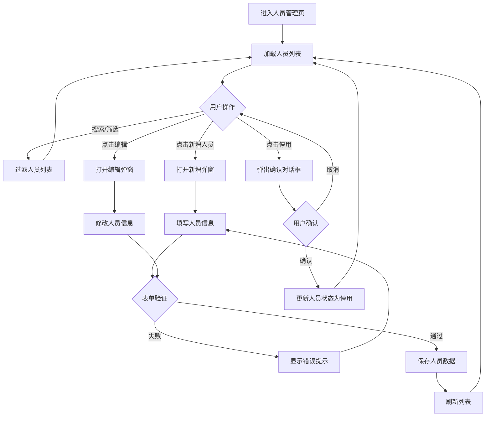

---

## 八、车辆管理

### 8.1 功能描述
维护城市管理车辆信息，支持新增、编辑、删除车辆，并可按状态和类型筛选。

### 8.2 页面布局
- 顶部：标题"车辆管理"
- 搜索与筛选区域（搜索框、状态筛选、类型筛选）
- 车辆列表（表格形式）
- 新增车辆按钮
- 新增/编辑车辆弹窗（Modal）
- 车辆详情弹窗（Modal）

### 8.3 字段说明

#### 8.3.1 搜索与筛选区域

| 字段名称 | 字段类型 | 是否必填 | 默认值 | 说明 | 交互规则 |
|---------|---------|---------|-------|------|---------|
| 搜索关键词 | 输入框（文本） | 否 | 空 | 搜索车牌号、司机姓名、电话 | 实时过滤 |
| 状态筛选 | 下拉框（Select） | 否 | 全部 | 按车辆状态筛选 | 立即过滤 |
| 类型筛选 | 下拉框（Select） | 否 | 全部 | 按车辆类型筛选 | 立即过滤 |

**状态选项**：全部、可用、使用中、维修中、不可用

#### 8.3.2 车辆列表字段

| 字段名称 | 字段类型 | 是否必填 | 说明 | 备注 |
|---------|---------|---------|------|------|
| 车牌号 | 文本展示 | 是 | 车辆车牌号码 | - |
| 车辆类型 | 文本展示 | 是 | 如：自卸车、密封式垃圾车 | - |
| 载重量 | 文本展示 | 是 | 单位：吨 | - |
| 状态 | 标签（Badge） | 是 | 可用/使用中/维修中/不可用 | 不同颜色 |
| 司机姓名 | 文本展示 | 是 | 司机姓名 | - |
| 司机电话 | 文本展示 | 是 | 司机联系电话 | - |
| 注册日期 | 文本展示 | 是 | 格式：YYYY-MM-DD | - |
| 最近维保日期 | 文本展示 | 是 | 格式：YYYY-MM-DD | - |
| 操作 | 按钮组 | - | 查看、编辑、删除 | - |

#### 8.3.3 新增/编辑车辆弹窗字段

| 字段名称 | 字段类型 | 是否必填 | 选项/格式 | 说明 | 交互规则 | 备注 |
|---------|---------|---------|---------|------|---------|------|
| 车牌号 | 输入框（文本） | 是 | 车牌号格式 | 车辆车牌号码 | 为空时提交报错 | placeholder: "如：沪A12345" |
| 车辆类型 | 输入框（文本） | 是 | 文本 | 车辆类型名称 | 为空时提交报错 | placeholder: "如：自卸车" |
| 载重量 | 输入框（数字） | 是 | 数字，单位：吨 | 车辆载重量 | 为空或≤0时报错 | placeholder: "请输入载重量（吨）" |
| 状态 | 下拉框（Select） | 是 | 可用/使用中/维修中/不可用 | 车辆当前状态 | 默认"可用" | - |
| 司机姓名 | 输入框（文本） | 是 | 文本 | 司机姓名 | 为空时提交报错 | - |
| 司机电话 | 输入框（文本） | 是 | 手机号格式 | 司机联系电话 | 为空时提交报错 | - |
| 注册日期 | 日期选择器（date） | 是 | YYYY-MM-DD | 车辆注册日期 | 为空时提交报错 | - |
| 最近维保日期 | 日期选择器（date） | 是 | YYYY-MM-DD | 最近一次维保日期 | 为空时提交报错 | - |

### 8.4 交互规则
1. 搜索和筛选实时过滤列表
2. 点击"新增车辆"打开新增弹窗，表单重置
3. 点击"编辑"打开编辑弹窗，预填当前数据
4. 点击"查看"打开车辆详情弹窗（只读）
5. 点击"删除"弹出确认对话框，确认后删除
6. 提交成功后关闭弹窗，刷新列表

### 8.5 处理逻辑
1. 数据从API或本地状态加载
2. 新增：生成唯一ID，添加到列表
3. 编辑：根据ID更新对应车辆数据
4. 删除：从列表中移除对应车辆

### 8.6 异常逻辑
1. 必填字段为空时提交：显示错误提示
2. 载重量≤0时：显示错误提示"载重量必须大于0"
3. 删除时弹出确认对话框

### 8.7 流程图

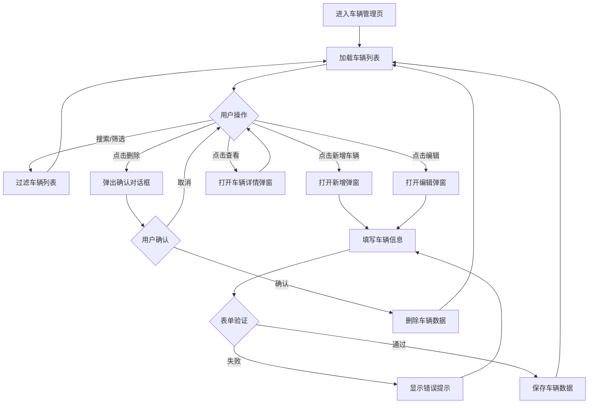

---
# 管理后台端PRD - 第三部分：建筑垃圾全链路管理

---

## 九、建筑垃圾全链路管理

### 9.1 功能描述
对建筑垃圾清运全流程进行管理，包含四个子模块：清运任务管理、点位信息维护、车辆备案管理、清运申请审批。

### 9.2 页面布局
- 顶部：标题"建筑垃圾全链路管理"、副标题
- Tab导航栏：清运任务管理 / 点位信息维护 / 车辆备案管理 / 清运任务审批
- Tab内容区域

---

### 9.3 子模块一：清运任务管理

#### 9.3.1 功能描述
查看和管理所有建筑垃圾清运任务，包含任务状态跟踪、路线查看、现场照片等。

#### 9.3.2 字段说明

**任务列表字段**：

| 字段名称 | 字段类型 | 是否必填 | 说明 | 备注 |
|---------|---------|---------|------|------|
| 任务ID | 文本展示 | 是 | 清运任务唯一标识 | - |
| 申请人姓名 | 文本展示 | 是 | 提交申请的人员 | - |
| 车牌号 | 文本展示 | 是 | 清运车辆车牌 | - |
| 司机姓名 | 文本展示 | 是 | 司机姓名 | - |
| 起点位置 | 文本展示 | 是 | 建筑垃圾起点（施工点位） | - |
| 终点位置 | 文本展示 | 是 | 垃圾处理厂 | - |
| 垃圾类型 | 文本展示 | 是 | 建筑垃圾/装修垃圾/拆除垃圾 | - |
| 预估重量 | 文本展示 | 是 | 单位：吨 | - |
| 实际重量 | 文本展示 | 否 | 实际清运重量（吨） | 完成后填写 |
| 任务状态 | 标签（Badge） | 是 | 待执行/执行中/已完成/已取消 | 不同颜色 |
| 申请时间 | 文本展示 | 是 | 格式：YYYY-MM-DD HH:mm | - |
| 操作 | 按钮组 | - | 查看详情、查看路线、查看照片 | - |

**搜索筛选字段**：

| 字段名称 | 字段类型 | 默认值 | 说明 |
|---------|---------|-------|------|
| 搜索关键词 | 输入框（文本） | 空 | 搜索申请人、车牌号、起终点 |
| 状态筛选 | 下拉框（Select） | 全部 | 按任务状态筛选 |
| 日期范围 | 日期范围选择器 | 空 | 按申请时间筛选 |

#### 9.3.3 交互规则
1. 列表按申请时间倒序排列
2. 点击"查看详情"打开任务详情弹窗，展示完整信息
3. 点击"查看路线"打开路线地图弹窗，显示起点到终点的路线
4. 点击"查看照片"打开照片预览弹窗，展示现场照片

---

### 9.4 子模块二：点位信息维护

#### 9.4.1 功能描述
维护垃圾处理厂和施工点位两类基础数据，支持新增、编辑、删除。

#### 9.4.2 内部Tab切换
- 垃圾处理厂
- 施工点位

#### 9.4.3 垃圾处理厂字段

**列表字段**：

| 字段名称 | 字段类型 | 是否必填 | 说明 | 备注 |
|---------|---------|---------|------|------|
| 处理厂名称 | 文本展示 | 是 | 垃圾处理厂名称 | - |
| 地址 | 文本展示 | 是 | 处理厂地址 | - |
| 处理能力 | 文本展示 | 是 | 单位：吨/天 | - |
| 联系人 | 文本展示 | 是 | 联系人姓名 | - |
| 联系电话 | 文本展示 | 是 | 联系电话 | - |
| 状态 | 文本展示 | 是 | 正常运行/停运维修 | - |
| 操作 | 按钮组 | - | 编辑、删除 | - |

**新增/编辑弹窗字段**：

| 字段名称 | 字段类型 | 是否必填 | 说明 | 交互规则 |
|---------|---------|---------|------|---------|
| 处理厂名称 | 输入框（文本） | 是 | 处理厂名称 | 为空时报错 |
| 地址 | 输入框（文本） | 是 | 详细地址 | 为空时报错 |
| 处理能力 | 输入框（数字） | 是 | 吨/天 | 为空或≤0时报错 |
| 联系人 | 输入框（文本） | 是 | 联系人姓名 | 为空时报错 |
| 联系电话 | 输入框（文本） | 是 | 手机号 | 为空时报错 |
| 状态 | 下拉框（Select） | 是 | 正常运行/停运维修 | 默认"正常运行" |

#### 9.4.4 施工点位字段

**列表字段**：

| 字段名称 | 字段类型 | 是否必填 | 说明 | 备注 |
|---------|---------|---------|------|------|
| 点位名称 | 文本展示 | 是 | 施工点位名称 | - |
| 地址 | 文本展示 | 是 | 施工地址 | - |
| 项目名称 | 文本展示 | 是 | 建设项目名称 | - |
| 施工单位 | 文本展示 | 是 | 施工企业名称 | - |
| 联系人 | 文本展示 | 是 | 现场联系人 | - |
| 联系电话 | 文本展示 | 是 | 联系电话 | - |
| 预估垃圾量 | 文本展示 | 是 | 单位：吨 | - |
| 开始日期 | 文本展示 | 是 | 格式：YYYY-MM-DD | - |
| 结束日期 | 文本展示 | 是 | 格式：YYYY-MM-DD | - |
| 状态 | 文本展示 | 是 | 进行中/已完成/暂停 | - |
| 操作 | 按钮组 | - | 编辑、删除 | - |

**新增/编辑弹窗字段**：

| 字段名称 | 字段类型 | 是否必填 | 说明 | 交互规则 |
|---------|---------|---------|------|---------|
| 点位名称 | 输入框（文本） | 是 | 施工点位名称 | 为空时报错 |
| 地址 | 输入框（文本） | 是 | 详细地址 | 为空时报错 |
| 项目名称 | 输入框（文本） | 是 | 建设项目名称 | 为空时报错 |
| 施工单位 | 输入框（文本） | 是 | 施工企业名称 | 为空时报错 |
| 联系人 | 输入框（文本） | 是 | 现场联系人 | 为空时报错 |
| 联系电话 | 输入框（文本） | 是 | 联系电话 | 为空时报错 |
| 预估垃圾量 | 输入框（数字） | 是 | 吨 | 为空或≤0时报错 |
| 开始日期 | 日期选择器 | 是 | YYYY-MM-DD | 为空时报错 |
| 结束日期 | 日期选择器 | 是 | YYYY-MM-DD | 不能早于开始日期 |
| 状态 | 下拉框（Select） | 是 | 进行中/已完成/暂停 | 默认"进行中" |

---

### 9.5 子模块三：车辆备案管理

#### 9.5.1 功能描述
管理已备案的建筑垃圾清运车辆，支持新增、编辑、删除，并可查看车辆备案状态。

#### 9.5.2 字段说明

**搜索筛选字段**：

| 字段名称 | 字段类型 | 默认值 | 说明 |
|---------|---------|-------|------|
| 搜索关键词 | 输入框（文本） | 空 | 搜索车牌号、司机姓名、电话 |
| 状态筛选 | 下拉框（Select） | 全部 | 在用/停用/已过期 |

**车辆列表字段**：

| 字段名称 | 字段类型 | 是否必填 | 说明 | 备注 |
|---------|---------|---------|------|------|
| 车牌号 | 文本展示 | 是 | 车辆车牌号码 | - |
| 车辆类型 | 文本展示 | 是 | 重型/中型/轻型自卸货车 | - |
| 载重量 | 文本展示 | 是 | 单位：吨 | - |
| 司机姓名 | 文本展示 | 是 | 司机姓名 | - |
| 司机电话 | 文本展示 | 是 | 联系电话 | - |
| 备案日期 | 文本展示 | 是 | 格式：YYYY-MM-DD | - |
| 到期日期 | 文本展示 | 是 | 格式：YYYY-MM-DD | 临近到期时高亮提示 |
| 状态 | 标签（Badge） | 是 | 在用/停用/已过期 | 绿/灰/红 |
| 车辆照片 | 图片缩略图 | 否 | 车辆照片 | 点击放大 |
| 操作 | 按钮组 | - | 编辑、删除 | - |

**新增/编辑弹窗字段**：

| 字段名称 | 字段类型 | 是否必填 | 说明 | 交互规则 |
|---------|---------|---------|------|---------|
| 车牌号 | 输入框（文本） | 是 | 车辆车牌号码 | 为空时报错 |
| 车辆类型 | 下拉框（Select） | 是 | 重型/中型/轻型自卸货车 | 为空时报错 |
| 载重量 | 输入框（数字） | 是 | 吨 | 为空或≤0时报错 |
| 司机姓名 | 输入框（文本） | 是 | 司机姓名 | 为空时报错 |
| 司机电话 | 输入框（文本） | 是 | 手机号 | 为空时报错 |
| 备案日期 | 日期选择器 | 是 | YYYY-MM-DD | 为空时报错 |
| 到期日期 | 日期选择器 | 是 | YYYY-MM-DD | 不能早于备案日期 |
| 状态 | 下拉框（Select） | 是 | 在用/停用/已过期 | 默认"在用" |
| 车辆照片 | 图片上传 | 否 | 上传车辆照片 | 支持jpg/png |

---

### 9.6 子模块四：清运申请审批

#### 9.6.1 功能描述
对小程序端提交的建筑垃圾清运申请进行审批，审批通过后系统自动生成二维码供核销使用。

#### 9.6.2 字段说明

**搜索筛选字段**：

| 字段名称 | 字段类型 | 默认值 | 说明 |
|---------|---------|-------|------|
| 搜索关键词 | 输入框（文本） | 空 | 搜索申请ID、申请人、车牌号 |
| 状态筛选 | 下拉框（Select） | 全部 | 待审批/已通过/已驳回 |

**申请列表字段**：

| 字段名称 | 字段类型 | 是否必填 | 说明 | 备注 |
|---------|---------|---------|------|------|
| 申请ID | 文本展示 | 是 | 申请唯一标识 | - |
| 申请人姓名 | 文本展示 | 是 | 申请人姓名 | - |
| 申请人电话 | 文本展示 | 是 | 联系电话 | - |
| 车牌号 | 文本展示 | 是 | 清运车辆车牌 | - |
| 司机姓名 | 文本展示 | 是 | 司机姓名 | - |
| 起点位置 | 文本展示 | 是 | 施工点位名称 | - |
| 终点位置 | 文本展示 | 是 | 垃圾处理厂名称 | - |
| 垃圾类型 | 文本展示 | 是 | 建筑/装修/拆除垃圾 | - |
| 预估重量 | 文本展示 | 是 | 单位：吨 | - |
| 申请时间 | 文本展示 | 是 | 格式：YYYY-MM-DD HH:mm | - |
| 审批状态 | 标签（Badge） | 是 | 待审批/已通过/已驳回 | 黄/绿/红 |
| 操作 | 按钮组 | - | 审批通过、审批驳回、查看详情 | 仅待审批状态显示审批按钮 |

**审批驳回弹窗字段**：

| 字段名称 | 字段类型 | 是否必填 | 说明 | 交互规则 |
|---------|---------|---------|------|---------|
| 驳回原因 | 多行文本框（Textarea） | 是 | 填写驳回原因 | 为空时确认按钮禁用 |
| 确认驳回 | 主要按钮 | - | 确认驳回申请 | 原因为空时禁用 |
| 取消 | 次要按钮 | - | 关闭弹窗 | - |

#### 9.6.3 交互规则
1. 列表按申请时间倒序排列，待审批的申请置顶显示
2. 点击"审批通过"：直接通过，系统自动生成二维码，申请状态变为"已通过"，显示成功提示
3. 点击"审批驳回"：打开驳回原因弹窗，填写原因后确认，申请状态变为"已驳回"
4. 点击"查看详情"：打开申请详情弹窗，展示完整申请信息和状态历史
5. 审批通过后，申请人在小程序端可查看二维码

#### 9.6.4 处理逻辑
1. 审批通过：更新申请状态为"approved"，生成二维码URL（基于申请ID）
2. 审批驳回：更新申请状态为"rejected"，记录驳回原因和驳回时间
3. 状态历史：每次状态变更自动追加到statusHistory数组

#### 9.6.5 异常逻辑
1. 驳回原因为空时确认：确认按钮禁用，无法提交
2. 重复审批：已通过/已驳回的申请不显示审批按钮

### 9.7 建筑垃圾管理整体流程图

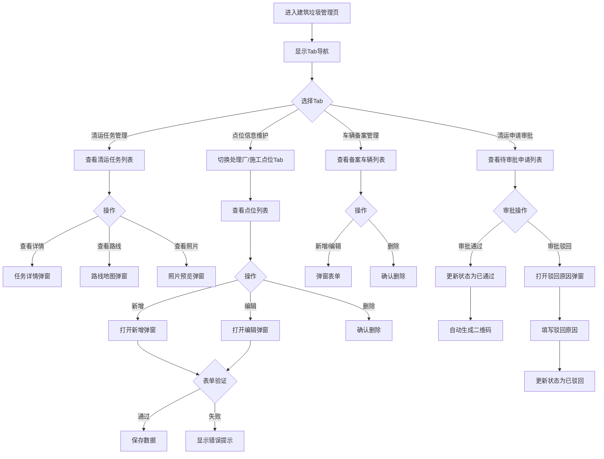

---
# 管理后台端PRD - 第四部分：举报处理、统计分析、基础数据维护

---

## 十、举报与事件处理

### 10.1 功能描述
查看和处理市民通过小程序提交的举报事件，支持指派处理人、跟踪处理进度、关闭事件。

### 10.2 页面布局
- 顶部导航栏：返回按钮、标题"举报与事件处理"
- 搜索与筛选区域
- 举报列表（卡片形式）
- 处理弹窗（Modal）
- 详情弹窗（Modal）

### 10.3 字段说明

#### 10.3.1 搜索与筛选区域

| 字段名称 | 字段类型 | 是否必填 | 默认值 | 说明 | 交互规则 |
|---------|---------|---------|-------|------|---------|
| 搜索关键词 | 输入框（文本） | 否 | 空 | 搜索标题、描述、位置 | 实时过滤 |
| 状态筛选 | 下拉框（Select） | 否 | 全部 | 按处理状态筛选 | 立即过滤 |
| 类型筛选 | 下拉框（Select） | 否 | 全部 | 按举报类型筛选 | 立即过滤 |
| 排序方式 | 下拉框（Select） | 否 | 上报时间 | 排序字段 | 立即重排 |

**状态选项**：全部、待处理、处理中、已完成、已驳回

**举报类型选项**：垃圾问题、环境卫生、公共设施、交通问题、噪音污染、其他问题

#### 10.3.2 举报列表字段

| 字段名称 | 字段类型 | 是否必填 | 说明 | 备注 |
|---------|---------|---------|------|------|
| 举报标题 | 文本展示 | 是 | 举报事件标题 | 加粗显示 |
| 举报状态 | 标签（Badge） | 是 | 待处理/处理中/已完成/已驳回 | 不同颜色 |
| 举报类型 | 标签（Badge） | 是 | 事件类型 | 蓝色标签 |
| 举报描述 | 文本展示 | 否 | 事件详细描述 | 最多2行 |
| 举报位置 | 文本展示（带图标） | 是 | 事件发生地址 | 带定位图标 |
| 上报时间 | 文本展示 | 是 | 格式：YYYY-MM-DD HH:mm | - |
| 举报人 | 文本展示 | 是 | 举报人姓名 | - |
| 处理人 | 文本展示 | 否 | 指派的处理人员 | 有指派后显示 |
| 处理时间 | 文本展示 | 否 | 开始处理时间 | 处理中/已完成时显示 |
| 完成时间 | 文本展示 | 否 | 处理完成时间 | 已完成时显示 |
| 用户图片 | 图片缩略图 | 否 | 用户上传的举报图片 | 最多3张，点击放大 |
| 操作 | 按钮组 | - | 处理、查看详情 | 待处理/处理中显示"处理"按钮 |

#### 10.3.3 处理弹窗字段

| 字段名称 | 字段类型 | 是否必填 | 选项/格式 | 说明 | 交互规则 |
|---------|---------|---------|---------|------|---------|
| 处理备注 | 多行文本框（Textarea） | 否 | 文本 | 处理说明 | placeholder: "请输入处理备注" |
| 指派处理人 | 下拉框（Select） | 是 | 管理人员列表 | 选择负责处理的人员 | 仅显示管理人员（personType=管理人员） |
| 处理前图片 | 图片上传（多选） | 否 | 图片格式 | 上传处理前现场照片 | 支持多选 |
| 确认处理 | 主要按钮 | - | - | 确认指派并开始处理 | 未选择处理人时禁用 |
| 取消 | 次要按钮 | - | - | 关闭弹窗 | - |

#### 10.3.4 详情弹窗字段

| 字段名称 | 字段类型 | 说明 | 备注 |
|---------|---------|------|------|
| 基本信息 | 文本展示 | 标题、类型、状态、位置、上报时间、举报人 | 只读 |
| 举报描述 | 文本展示 | 详细描述 | 只读 |
| 处理信息 | 文本展示 | 处理人、处理时间、处理备注 | 有处理记录时显示 |
| 完成信息 | 文本展示 | 完成时间 | 已完成时显示 |
| 用户图片 | 图片展示 | 用户上传的举报图片 | 点击放大预览 |
| 处理前图片 | 图片展示 | 管理员上传的处理前照片 | 点击放大预览 |

### 10.4 交互规则
1. 列表按上报时间倒序排列，待处理事件置顶
2. 搜索和筛选实时过滤列表
3. 点击"处理"按钮打开处理弹窗，预填当前举报信息
4. 处理弹窗中，处理人下拉框仅显示管理人员
5. 确认处理后：举报状态变为"处理中"，记录处理人和处理时间
6. 点击"查看详情"打开详情弹窗（只读）
7. 图片点击可放大预览，支持左右切换

### 10.5 处理逻辑
1. 举报数据从API或localStorage加载
2. 指派处理：更新举报状态为"processing"，记录processPerson和processTime
3. 处理人列表：从usePeople Hook获取所有活跃的管理人员

### 10.6 异常逻辑
1. 未选择处理人时确认：确认按钮禁用
2. 举报列表为空：显示空状态提示
3. 图片加载失败：显示占位图

### 10.7 流程图

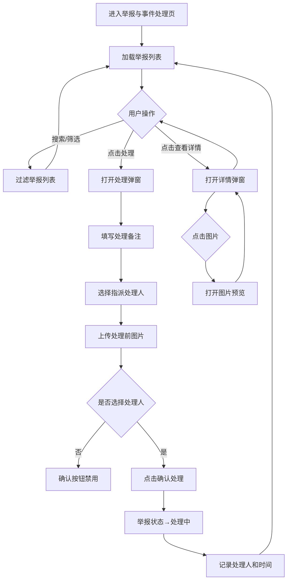

---

## 十一、统计分析

### 11.1 功能描述
提供多维度的数据统计分析，包括个人维度、团队维度、区域维度，展示检查次数、问题发现率、整改率、覆盖率等核心指标，并提供趋势图、对比图、分布图等可视化图表。

### 11.2 页面布局
- 顶部：标题"统计分析"、导出按钮
- 维度切换Tab：个人维度 / 团队维度 / 区域维度
- 筛选区域（时间范围、人员/团队/区域选择）
- 核心指标卡片（4个）
- 对比图表（柱状图）
- 趋势图表（折线图）
- 问题分布图（饼图）
- 整改状态图（进度条）

### 11.3 字段说明

#### 11.3.1 维度切换与筛选

| 字段名称 | 字段类型 | 是否必填 | 默认值 | 说明 | 交互规则 |
|---------|---------|---------|-------|------|---------|
| 统计维度 | 标签页（Tab） | 否 | 个人维度 | 切换统计维度 | 切换后刷新所有图表数据 |
| 时间范围 | 下拉框（Select） | 否 | 本月 | 统计时间范围 | 选项：本周/本月/本季度/本年/自定义 |
| 自定义开始日期 | 日期选择器 | 条件必填 | 空 | 自定义时间起始 | 仅时间范围选"自定义"时显示 |
| 自定义结束日期 | 日期选择器 | 条件必填 | 空 | 自定义时间结束 | 仅时间范围选"自定义"时显示 |
| 人员/团队/区域 | 下拉框（Select） | 否 | 全部 | 按维度筛选 | 根据当前Tab动态变化 |

#### 11.3.2 核心指标卡片

| 指标名称 | 字段类型 | 说明 | 备注 |
|---------|---------|------|------|
| 检查总次数 | 数字展示 | 统计期内检查总次数 | 带环比变化百分比 |
| 发现问题数 | 数字展示 | 统计期内发现的问题总数 | 带环比变化百分比 |
| 整改完成率 | 百分比展示 | 已整改/总问题数 | 带环比变化百分比 |
| 覆盖率 | 百分比展示 | 已检查区域/总区域 | 带环比变化百分比 |

#### 11.3.3 对比图表（柱状图）

| 字段名称 | 说明 | 备注 |
|---------|------|------|
| X轴 | 指标名称（检查次数/问题数/整改率/覆盖率） | - |
| Y轴 | 数值 | - |
| 数据系列 | 序化团队 vs 城管团队 | 两组柱状对比 |
| 图表标题 | 动态显示当前维度和时间范围 | - |

#### 11.3.4 趋势图表（折线图）

| 字段名称 | 说明 | 备注 |
|---------|------|------|
| X轴 | 时间（周/月） | - |
| Y轴 | 检查次数 | - |
| 数据系列 | 多个人员/团队/区域的趋势线 | 不同颜色区分 |

#### 11.3.5 问题分布图（饼图）

| 字段名称 | 说明 | 备注 |
|---------|------|------|
| 分类 | 问题类型（垃圾分类/道路清洁/市政绿化/工地监管等） | - |
| 占比 | 各类型问题占总问题数的百分比 | - |
| 颜色 | 每种类型对应不同颜色 | - |

#### 11.3.6 整改状态进度条

| 字段名称 | 说明 | 备注 |
|---------|------|------|
| 已完成整改 | 百分比进度条（绿色） | 显示具体百分比数值 |
| 待整改 | 百分比进度条（橙色） | 显示具体百分比数值 |

### 11.4 交互规则
1. 切换维度Tab后，筛选条件和图表数据同步刷新
2. 修改筛选条件后，所有图表数据自动刷新
3. 图表支持鼠标悬停显示详细数值（Tooltip）
4. 点击"导出"按钮导出当前统计数据为Excel/PDF
5. 图表支持点击图例切换显示/隐藏对应数据系列

### 11.5 处理逻辑
1. 统计数据从API获取，根据维度和时间范围参数查询
2. 图表使用Recharts库渲染
3. 导出功能：将当前数据转换为CSV格式下载

### 11.6 异常逻辑
1. 数据加载失败：显示错误提示，提供重试按钮
2. 无数据时：图表显示空状态提示
3. 自定义时间结束日期早于开始日期：显示错误提示

### 11.7 流程图

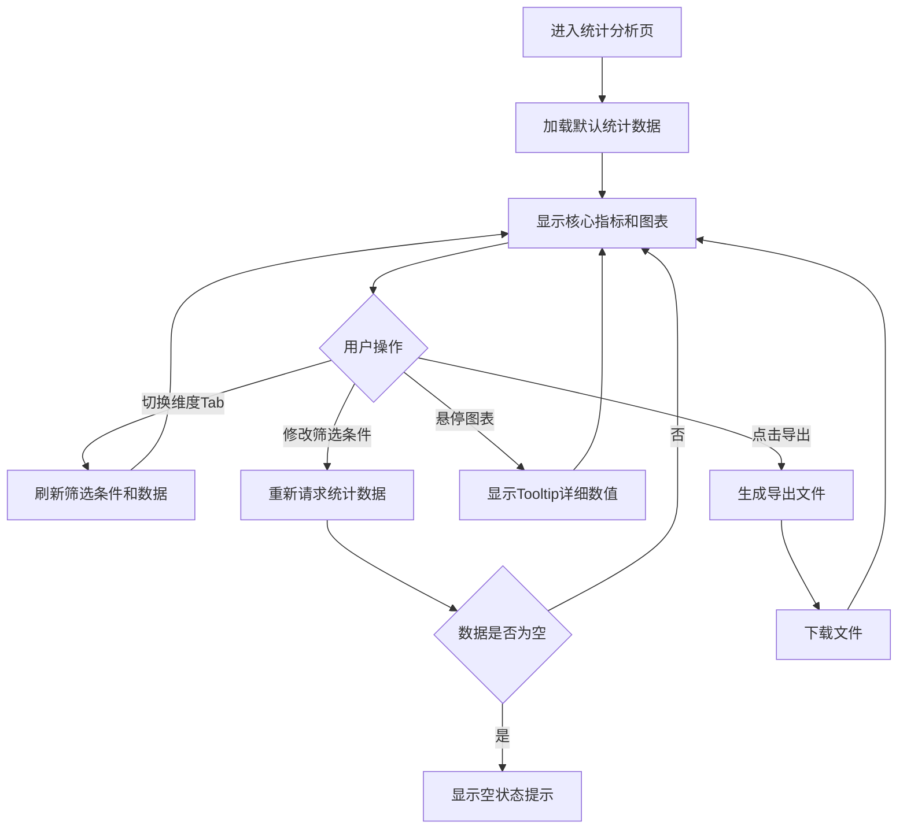

---

## 十二、基础数据维护

### 12.1 功能描述
维护城市管理所需的基础数据，包括道路信息、公厕信息、绿化信息三类，支持新增、编辑、删除和搜索。

### 12.2 页面布局
- 顶部导航栏：返回按钮、标题"基础数据维护"
- Tab导航栏：道路信息 / 公厕信息 / 绿化信息
- 搜索框
- 数据列表（表格形式）
- 新增/编辑弹窗（Modal）

---

### 12.3 子模块一：道路信息

#### 12.3.1 字段说明

**列表字段**：

| 字段名称 | 字段类型 | 是否必填 | 说明 | 备注 |
|---------|---------|---------|------|------|
| 道路名称 | 文本展示 | 是 | 道路名称 | - |
| 路段 | 文本展示 | 是 | 道路起止路段描述 | - |
| 面积 | 文本展示 | 是 | 单位：M² | - |
| 单位 | 文本展示 | 是 | M2 | - |
| 类型 | 标签（Badge） | 是 | 一类/二类 | 不同颜色 |
| 操作 | 按钮组 | - | 编辑、删除 | - |

**新增/编辑弹窗字段**：

| 字段名称 | 字段类型 | 是否必填 | 说明 | 交互规则 |
|---------|---------|---------|------|---------|
| 道路名称 | 输入框（文本） | 是 | 道路名称 | 为空时报错 |
| 路段 | 输入框（文本） | 是 | 起止路段描述 | 为空时报错 |
| 面积 | 输入框（数字） | 是 | 单位：M² | 为空或≤0时报错 |
| 单位 | 输入框（文本） | 是 | 默认M2 | 默认值"M2" |
| 类型 | 下拉框（Select） | 是 | 一类/二类 | 为空时报错 |

---

### 12.4 子模块二：公厕信息

#### 12.4.1 字段说明

**列表字段**：

| 字段名称 | 字段类型 | 是否必填 | 说明 | 备注 |
|---------|---------|---------|------|------|
| 公厕名称 | 文本展示 | 是 | 公厕名称 | - |
| 公厕类型 | 文本展示 | 是 | 标准公厕/移动公厕等 | - |
| 地址 | 文本展示 | 是 | 详细地址 | - |
| 编号 | 文本展示 | 否 | 公厕编号 | - |
| 面积 | 文本展示 | 是 | 单位：M² | - |
| 操作 | 按钮组 | - | 编辑、删除 | - |

**新增/编辑弹窗字段**：

| 字段名称 | 字段类型 | 是否必填 | 说明 | 交互规则 |
|---------|---------|---------|------|---------|
| 公厕名称 | 输入框（文本） | 是 | 公厕名称 | 为空时报错 |
| 公厕类型 | 下拉框（Select） | 是 | 标准公厕/移动公厕/临时公厕 | 为空时报错 |
| 地址 | 输入框（文本） | 是 | 详细地址 | 为空时报错 |
| 编号 | 输入框（文本） | 否 | 公厕编号 | - |
| 面积 | 输入框（数字） | 是 | 单位：M² | 为空或≤0时报错 |

---

### 12.5 子模块三：绿化信息

#### 12.5.1 字段说明

**列表字段**：

| 字段名称 | 字段类型 | 是否必填 | 说明 | 备注 |
|---------|---------|---------|------|------|
| 道路名称 | 文本展示 | 是 | 绿化所在道路 | - |
| 路段 | 文本展示 | 是 | 起止路段描述 | - |
| 面积 | 文本展示 | 是 | 单位：M² | - |
| 单位 | 文本展示 | 是 | M2 | - |
| 类型 | 标签（Badge） | 是 | 一类/二类 | - |
| 备注 | 文本展示 | 否 | 补充说明 | - |
| 操作 | 按钮组 | - | 编辑、删除 | - |

**新增/编辑弹窗字段**：

| 字段名称 | 字段类型 | 是否必填 | 说明 | 交互规则 |
|---------|---------|---------|------|---------|
| 道路名称 | 输入框（文本） | 是 | 绿化所在道路 | 为空时报错 |
| 路段 | 输入框（文本） | 是 | 起止路段描述 | 为空时报错 |
| 面积 | 输入框（数字） | 是 | 单位：M² | 为空或≤0时报错 |
| 单位 | 输入框（文本） | 是 | 默认M2 | 默认值"M2" |
| 类型 | 下拉框（Select） | 是 | 一类/二类 | 为空时报错 |
| 备注 | 多行文本框（Textarea） | 否 | 补充说明 | - |

### 12.6 通用交互规则（三个子模块共用）
1. 切换Tab时加载对应数据列表
2. 搜索框实时过滤列表（按名称、路段/地址等关键字段）
3. 点击"新增"打开新增弹窗，表单重置为默认值
4. 点击"编辑"打开编辑弹窗，预填当前数据
5. 点击"删除"弹出确认对话框，确认后删除
6. 提交成功后关闭弹窗，刷新列表，显示成功提示

### 12.7 处理逻辑
1. 数据从API或本地状态加载
2. 新增：生成唯一ID，添加到列表
3. 编辑：根据ID更新对应数据
4. 删除：从列表中移除对应数据

### 12.8 异常逻辑
1. 必填字段为空时提交：显示错误提示，阻止提交
2. 面积≤0时：显示错误提示"面积必须大于0"
3. 删除时弹出确认对话框，防止误操作

### 12.9 流程图

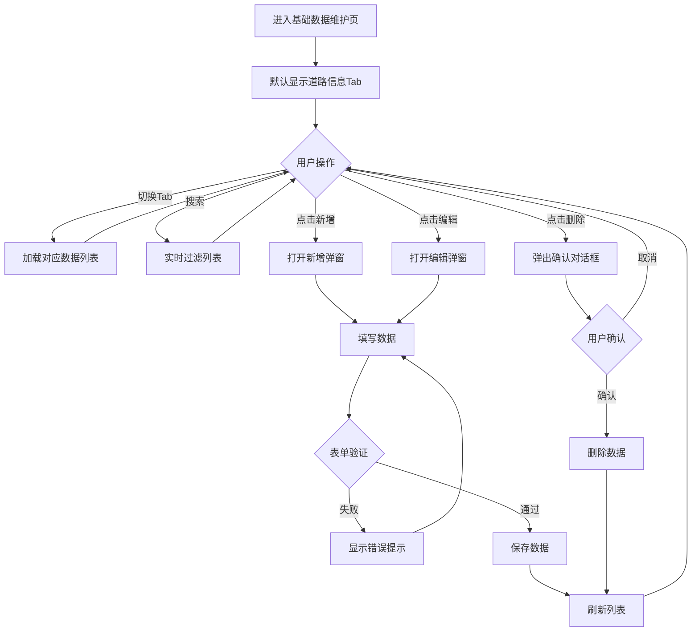

---
